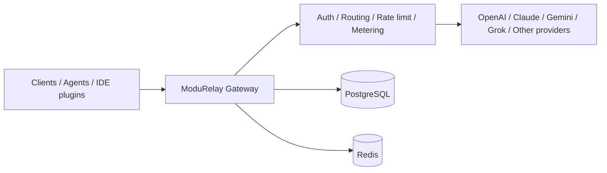

# ModuRelay

**ModuRelay AI Gateway**

Connect once. Route any model.

[English](README.md) | [简体中文](README_CN.md) | [日本語](README_JA.md)

---

[](LICENSE)
[](https://golang.org/)
[](https://vuejs.org/)
[](https://www.postgresql.org/)
[](https://redis.io/)
[](https://www.docker.com/)

## Overview

ModuRelay is an open-source AI API gateway for multi-provider routing, account pooling, usage metering, and API management.

It helps you:

- Connect multiple upstream AI providers through one gateway
- Manage account pools and distribute API Keys
- Route traffic with scheduling and sticky sessions
- Meter token usage and apply concurrency / rate limits
- Operate the system from a built-in admin console

ModuRelay can serve as a model access layer for self-hosted agents, IDE plugins, and other AI tools that speak OpenAI-compatible or provider-native APIs.

> Integrations such as Langflow or ComfyUI-oriented workflows are planned. See [Roadmap](#roadmap).

## Project relationship

ModuRelay is an independently maintained derivative project based on [Sub2API](https://github.com/Wei-Shaw/sub2api).

- ModuRelay is **not** an official Sub2API project
- ModuRelay is **not** endorsed by the upstream maintainers
- Upstream repository: [Wei-Shaw/sub2api](https://github.com/Wei-Shaw/sub2api)
- License and copyright: see [LICENSE](LICENSE) and [NOTICE.md](NOTICE.md)

## Core features

| Feature | Description |
| --- | --- |
| Multi-account management | Manage upstream accounts across supported providers |
| Credential types | OAuth and API Key style credentials where the provider supports them |
| API Key management | Issue, rotate, and control access for end users |
| Smart scheduling | Select accounts with load-aware scheduling |
| Sticky sessions | Keep related requests on a preferred account when configured |
| Usage metering | Track token usage and request statistics |
| Billing controls | Apply multipliers, balances, and related billing settings |
| Concurrency control | Limit concurrent requests per user / group |
| RPM / rate limits | Apply RPM and related rate-limiting policies |
| Admin console | Vue-based dashboard for operators |
| Payments | Optional payment integrations (see `docs/PAYMENT.md`) |
| Docker deployment | Build and run with Docker Compose from source |

## Architecture



## Tech stack

| Layer | Technology |
| --- | --- |
| Backend | Go `1.26.5` (`backend/go.mod`) |
| Frontend | Vue `^3.4`, Vite, TypeScript, pnpm (`frontend/package.json`) |
| Database | PostgreSQL (Compose uses `postgres:18-alpine`) |
| Cache | Redis (Compose uses `redis:8-alpine`) |
| Deployment | Docker / Docker Compose, Linux systemd units, source builds |

## Quick start

A published ModuRelay Docker Hub / GHCR image is **not** available yet. Build from source.

### Prerequisites

- Docker and Docker Compose v2+
- Or a local Go + Node.js development environment (see [Local development](#local-development))

### Build and run with Docker Compose

```bash
git clone https://github.com/lien0219/modurelay.git
cd modurelay/deploy
cp .env.example .env
# Edit .env and set at least POSTGRES_PASSWORD (and preferably ADMIN_PASSWORD / JWT_SECRET)
docker compose -f docker-compose.dev.yml up --build -d
```

Open the service on the host port configured by `SERVER_PORT` (default `8080`).

> Current Compose service names, volumes, and default database identifiers still use legacy names retained for deployment compatibility. Target ModuRelay naming is documented in [BRANDING.md](BRANDING.md). Do not `docker pull` a ModuRelay image that has not been published.

More deploy options: [deploy/README.md](deploy/README.md)

## Local development

Also see [DEV_GUIDE.md](DEV_GUIDE.md).

### Backend

Requirements: Go `1.26.5+`, PostgreSQL, Redis.

```bash
cd backend
go run ./cmd/server/
```

Useful commands:

```bash
# Build binary to backend/bin/server
make -C backend build

# Unit tests
make -C backend test-unit

# Generate Ent code when schemas change
cd backend && go generate ./ent
```

### Frontend

Requirements: Node.js with pnpm (`packageManager` pins `pnpm@10.33.2`).

```bash
cd frontend
pnpm install
pnpm dev
pnpm typecheck
pnpm build
pnpm test:run
```

Root helpers:

```bash
make build
make test-frontend
make test-backend
```

## Branches and contribution

| Branch | Role |
| --- | --- |
| `develop` | Day-to-day integration |
| `main` | Stable releases |
| `upstream-main` | Mirror of upstream `main` only — no ModuRelay changes |
| `feature/*` / `fix/*` | Work branches merged into `develop` |

Workflow summary:

1. Branch from `develop`
2. Open a PR into `develop`
3. Promote tested changes to `main` for release

Docs:

- [docs/BRANCHING.md](docs/BRANCHING.md)
- [UPSTREAM.md](UPSTREAM.md)
- [CUSTOM_CHANGELOG.md](CUSTOM_CHANGELOG.md)
- [BRANDING.md](BRANDING.md)
- [NOTICE.md](NOTICE.md)

## Configuration

Copy `deploy/.env.example` or start from `deploy/config.example.yaml`. Do not commit secrets.

| Variable | Purpose |
| --- | --- |
| `SERVER_PORT` | HTTP listen port (default `8080`) |
| `SERVER_MODE` | e.g. `debug` / production modes used by the server |
| `RUN_MODE` | `standard` or `simple` |
| `DATABASE_HOST` / `DATABASE_PORT` / `DATABASE_USER` / `DATABASE_PASSWORD` / `DATABASE_DBNAME` | PostgreSQL connection |
| `REDIS_HOST` / `REDIS_PORT` / `REDIS_PASSWORD` / `REDIS_DB` | Redis connection |
| `ADMIN_EMAIL` / `ADMIN_PASSWORD` | Initial admin credentials for auto-setup flows |
| `JWT_SECRET` | JWT signing secret |
| `TOTP_ENCRYPTION_KEY` | Optional TOTP encryption key |
| `TZ` | Timezone |

There is no `MODURELAY_` environment prefix in the current codebase. Legacy deployment identifiers remain documented in [BRANDING.md](BRANDING.md).

## Deployment

Supported today:

| Method | Notes |
| --- | --- |
| Docker Compose (build from source) | Prefer `deploy/docker-compose.dev.yml` until a ModuRelay image is published |
| Docker image build | Root `Dockerfile` builds the full stack |
| Linux / systemd | Unit files live under `deploy/`; renaming to ModuRelay units is pending |
| Source run | `go run` / `make -C backend build` + frontend build |

> Formal ModuRelay binary/package/image renaming is tracked in [BRANDING.md](BRANDING.md). Until that migration lands, follow the scripts that exist in this repository rather than invented install paths.

## Roadmap

Planned work (not claimed as shipped):

- Complete ModuRelay branding assets and deployment identifier migration
- Multi-tenant capabilities
- Langflow integration guidance
- ComfyUI-oriented workflow access patterns
- Richer model routing policies
- Cost analysis views
- Enterprise private-deployment packaging
- Provider / plugin extension points

## Security and compliance

Please read carefully before deploying:

- Using this software with upstream providers may conflict with those providers’ terms of service. Review those agreements yourself.
- Use the software only in compliance with local laws and regulations.
- You are responsible for the accounts, API keys, and credentials you configure.
- Upstream account stability and provider availability are not guaranteed.
- This project does **not** provide any official authorization from AI providers.
- Operators assume deployment and operational risk.
- Do not use this project for unlawful purposes.

This notice is a ModuRelay project reminder. It does not restate any upstream commercial authorization claims.

## Sponsors

Upstream project sponsor listings are **not** reproduced here. They belong to Sub2API and do not represent ModuRelay sponsorship relationships.

For upstream sponsor information, see the [Sub2API repository](https://github.com/Wei-Shaw/sub2api).

## Contact

- GitHub Issues: [lien0219/modurelay/issues](https://github.com/lien0219/modurelay/issues)
- Repository: [lien0219/modurelay](https://github.com/lien0219/modurelay)

No separate website, email support channel, Discord, or chat group is published for ModuRelay at this time.

## License and attribution

- ModuRelay is distributed under the terms of the repository [LICENSE](LICENSE) (GNU LGPL v3).
- Upstream copyright and license notices are retained.
- ModuRelay-specific modifications are summarized in [NOTICE.md](NOTICE.md) and [CUSTOM_CHANGELOG.md](CUSTOM_CHANGELOG.md).
- Do not remove `LICENSE` or upstream copyright statements.
- ModuRelay has no official affiliation with Sub2API upstream maintainers.
