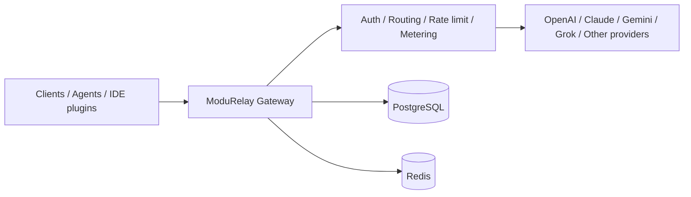

# ModuRelay

**ModuRelay AI Gateway**

Connect once. Route any model.

[English](README.md) | [简体中文](README_CN.md) | [日本語](README_JA.md)

---

[](LICENSE)
[](https://golang.org/)
[](https://vuejs.org/)
[](https://www.postgresql.org/)
[](https://redis.io/)
[](https://www.docker.com/)

<!-- Upstream sponsor listings are intentionally omitted; they do not represent ModuRelay sponsorship relationships. -->

## Overview

ModuRelay is an open-source AI API gateway for multi-provider routing, account pooling, usage metering, and API management.

It helps you:

- Connect multiple upstream AI providers through one gateway
- Manage account pools and distribute API Keys
- Route traffic with scheduling and sticky sessions
- Meter token usage and apply concurrency / rate limits
- Operate the system from a built-in admin console
- Support built-in payment and self-service top-up flows where configured
- Use composite groups to resolve requested models to concrete upstream providers
- Embed external systems such as ticketing pages into the admin dashboard

ModuRelay can serve as a model access layer for self-hosted agents, IDE plugins, and other AI tools that speak OpenAI-compatible or provider-native APIs.

> Integrations such as Langflow or ComfyUI-oriented workflows are planned. See [Roadmap](#roadmap).

## Important notice

Please read the following carefully before deploying or using this project:

- Using this software with upstream providers may conflict with those providers' terms of service. Review those agreements yourself.
- Use the software only in compliance with the laws and regulations of your country or region.
- You are responsible for the accounts, API keys, and credentials you configure.
- Upstream account stability and provider availability are not guaranteed.
- This project does not provide any official authorization from AI providers.
- Operators assume deployment and operational risk.
- Do not use this project for unlawful purposes.

## Project relationship

ModuRelay is an independently maintained derivative project based on [Sub2API](https://github.com/Wei-Shaw/sub2api).

- ModuRelay is **not** an official Sub2API project
- ModuRelay is **not** endorsed by the upstream maintainers
- Upstream repository: [Wei-Shaw/sub2api](https://github.com/Wei-Shaw/sub2api)
- License and copyright: see [LICENSE](LICENSE) and [NOTICE.md](NOTICE.md)

## Core features

| Feature | Description |
| --- | --- |
| Multi-account management | Manage upstream accounts across supported providers |
| Credential types | OAuth and API Key style credentials where the provider supports them |
| API Key management | Issue, rotate, and control access for end users |
| Smart scheduling | Select accounts with load-aware scheduling and sticky sessions |
| Usage metering | Track token usage and request statistics |
| Precise billing | Apply token-level usage tracking, multipliers, balances, and related billing settings |
| Concurrency control | Limit concurrent requests per user / group / account where supported |
| RPM / rate limits | Apply RPM and related rate-limiting policies |
| Admin console | Vue-based dashboard for operators |
| Payments | Built-in payment integrations such as EasyPay, Alipay, WeChat Pay, and Stripe where configured |
| Composite groups | Resolve requested models to concrete providers for multi-provider groups ([operator guide](docs/COMPOSITE_GROUPS.md)) |
| External system integration | Embed external systems such as ticketing pages into the admin dashboard via iframe |
| Docker deployment | Build and run with Docker Compose from source |

## Architecture


```mermaid
flowchart LR
  clients[Clients / Agents / IDE plugins]
  gateway[ModuRelay Gateway]
  control[Auth / Routing / Rate limit / Metering]
  providers[OpenAI / Claude / Gemini / Grok / Other providers]
  data[(PostgreSQL)]
  cache[(Redis)]

  clients --> gateway
  gateway --> control
  control --> providers
  gateway --> data
  gateway --> cache
```

## Tech stack

| Layer | Technology |
| --- | --- |
| Backend | Go `1.27.0` (`backend/go.mod`) |
| Frontend | Vue `^3.4`, Vite, TypeScript, pnpm (`frontend/package.json`) |
| Database | PostgreSQL 15+ |
| Cache | Redis 7+ |
| Deployment | Docker / Docker Compose, Linux systemd units, source builds |

## Quick start

A published ModuRelay Docker Hub / GHCR image is **not** available yet. Build from source.

### Prerequisites

- Docker and Docker Compose v2+
- Or a local Go + Node.js development environment (see [Local development](#local-development))

### Build and run with Docker Compose

```bash
git clone https://github.com/lien0219/modurelay.git
cd modurelay/deploy
cp .env.example .env
# Edit .env and set at least POSTGRES_PASSWORD (and preferably ADMIN_PASSWORD / JWT_SECRET)
docker compose -f docker-compose.dev.yml up --build -d
```

Open the service on the host port configured by `SERVER_PORT` (default `8080`).

> Current Compose service names, volumes, and default database identifiers still use legacy names retained for deployment compatibility. Target ModuRelay naming is documented in [BRANDING.md](BRANDING.md). Do not `docker pull` a ModuRelay image that has not been published.

More deploy options: [deploy/README.md](deploy/README.md)

## Local development

Also see [DEV_GUIDE.md](DEV_GUIDE.md).

### Backend

Requirements: Go `1.27.0+`, PostgreSQL, Redis.

```bash
cd backend
go run ./cmd/server/
```

Useful commands:

```bash
# Build binary to backend/bin/server
make -C backend build

# Unit tests
make -C backend test-unit

# Generate Ent code when schemas change
cd backend && go generate ./ent
```

### Frontend

Requirements: Node.js with pnpm (`packageManager` pins `pnpm@10.33.2`).

```bash
cd frontend
pnpm install
pnpm dev
pnpm typecheck
pnpm build
pnpm test:run
```

Root helpers:

```bash
make build
make test-frontend
make test-backend
```

> The `-tags embed` flag embeds the frontend build into the backend binary. Without it, the binary will not serve the frontend UI.

Key `config.yaml` areas to review before source deployment:

```yaml
server:
  host: "0.0.0.0"
  port: 8080
  mode: "release"

database:
  host: "localhost"
  port: 5432
  user: "postgres"
  password: "your_password"
  dbname: "sub2api"

redis:
  host: "localhost"
  port: 6379
  username: ""
  password: ""

jwt:
  secret: "change-this-to-a-secure-random-string"
  expire_hour: 24

default:
  user_concurrency: 5
  user_balance: 0
  api_key_prefix: "sk-"
  rate_multiplier: 1.0
```

Security-related options include CORS allowlists, upstream URL allowlists, response-header filtering, CSP, billing circuit breakers, trusted proxy handling, custom forwarded client IP headers, and Turnstile requirements. Custom client IP headers can also be supplied with:
Additional security-related options are available in `config.yaml`:

- `cors.allowed_origins` for CORS allowlist
- `security.url_allowlist` for upstream/pricing/CRS host allowlists
- `security.url_allowlist.enabled` to disable URL validation (use with caution)
- `security.url_allowlist.allow_insecure_http` to allow HTTP URLs when validation is disabled
- `security.url_allowlist.allow_private_hosts` to allow private/local IP addresses
- `security.response_headers.enabled` to enable configurable response header filtering (disabled uses default allowlist)
- `security.csp` to control Content-Security-Policy headers
- `billing.circuit_breaker` to fail closed on billing errors
- `security.trust_forwarded_ip_for_api_key_acl` enables legacy raw forwarded-header takeover (enabled by default for upgrade compatibility); disable it to enforce `server.trusted_proxies`, which should contain only the exact proxy CIDRs that connect directly to ModuRelay
- `security.forwarded_client_ip_headers` configures up to 16 third-party CDN client-IP header names; they are checked in order before the built-in headers only while legacy takeover is enabled
- `turnstile.required` to require Turnstile in release mode

Custom client-IP headers can be set in YAML or as a comma-separated environment variable:

```bash
SECURITY_FORWARDED_CLIENT_IP_HEADERS=True-Client-IP,X-CDN-Client-IP
```

For production, avoid allowing insecure HTTP upstream URLs unless the network boundary is explicitly controlled:

```bash
SECURITY_URL_ALLOWLIST_ENABLED=false
SECURITY_URL_ALLOWLIST_ALLOW_INSECURE_HTTP=false
```

### Nginx reverse proxy note

When reverse-proxying ModuRelay with Nginx and clients such as Codex CLI, add the following setting to the Nginx `http` block so underscore headers are preserved:

```nginx
underscores_in_headers on;
```

## Branches and contribution

| Branch | Role |
| --- | --- |
| `develop` | Day-to-day integration |
| `main` | Stable releases |
| `upstream-main` | Mirror of upstream `main` only — no ModuRelay changes |
| `feature/*` / `fix/*` | Work branches merged into `develop` |

Workflow summary:

1. Branch from `develop`
2. Open a PR into `develop`
3. Promote tested changes to `main` for release

Docs:

- [docs/BRANCHING.md](docs/BRANCHING.md)
- [UPSTREAM.md](UPSTREAM.md)
- [CUSTOM_CHANGELOG.md](CUSTOM_CHANGELOG.md)
- [BRANDING.md](BRANDING.md)
- [NOTICE.md](NOTICE.md)

## Configuration

Copy `deploy/.env.example` or start from `deploy/config.example.yaml`. Do not commit secrets.

| Variable | Purpose |
| --- | --- |
| `SERVER_PORT` | HTTP listen port (default `8080`) |
| `SERVER_MODE` | e.g. `debug` / production modes used by the server |
| `RUN_MODE` | `standard` or `simple` |
| `DATABASE_HOST` / `DATABASE_PORT` / `DATABASE_USER` / `DATABASE_PASSWORD` / `DATABASE_DBNAME` | PostgreSQL connection |
| `REDIS_HOST` / `REDIS_PORT` / `REDIS_PASSWORD` / `REDIS_DB` | Redis connection |
| `ADMIN_EMAIL` / `ADMIN_PASSWORD` | Initial admin credentials for auto-setup flows |
| `JWT_SECRET` | JWT signing secret |
| `TOTP_ENCRYPTION_KEY` | Optional TOTP encryption key |
| `XAI_GROK_CLI_VERSION` | Optional Grok CLI identity override; `0.2.114` is the minimum accepted version |
| `TZ` | Timezone |

There is no `MODURELAY_` environment prefix in the current codebase. Legacy deployment identifiers remain documented in [BRANDING.md](BRANDING.md).
#### Force OpenAI upstream HTTP/SSE

When an egress proxy or network repeatedly reconnects OpenAI Responses
WebSockets, set the global fallback in the persisted deployment configuration:

```yaml
gateway:
  openai_ws:
    force_http: true
```

For Compose and Apple container deployments, the equivalent `.env` setting is:

```bash
GATEWAY_OPENAI_WS_FORCE_HTTP=true
```

This selects HTTP/SSE for OpenAI upstream Responses traffic that would
otherwise use WebSocket. It does not change the client-facing protocol or force
HTTP/1.1; configure `gateway.openai_http2.enabled` (or
`GATEWAY_OPENAI_HTTP2_ENABLED=false`) separately when a proxy is incompatible
with HTTP/2. Unlike the account-level `http_bridge` mode, this global fallback
takes effect without enabling `mode_router_v2_enabled`. Keep the setting in the
deployment's persisted `.env` or `config.yaml`, rather than inside a running
container, so it is read again after an image update or container recreation.

#### ⚠️ Important: Creating the Admin Account

## Deployment

Supported today:

| Method | Notes |
| --- | --- |
| Docker Compose (build from source) | Prefer `deploy/docker-compose.dev.yml` until a ModuRelay image is published |
| Docker image build | Root `Dockerfile` builds the full stack |
| Linux / systemd | Unit files live under `deploy/`; renaming to ModuRelay units is pending |
| Source run | `go run` / `make -C backend build` + frontend build |

> Formal ModuRelay binary/package/image renaming is tracked in [BRANDING.md](BRANDING.md). Until that migration lands, follow the scripts that exist in this repository rather than invented install paths.

## Roadmap

Planned work (not claimed as shipped):

- Complete ModuRelay branding assets and deployment identifier migration
- Multi-tenant capabilities
- Langflow integration guidance
- ComfyUI-oriented workflow access patterns
- Richer model routing policies
- Cost analysis views
- Enterprise private-deployment packaging
- Provider / plugin extension points

## Security and compliance

This notice is a ModuRelay project reminder. It does not restate any upstream commercial authorization claims. See [Important notice](#important-notice) before deploying.

## Sponsors

Upstream project sponsor listings are **not** reproduced here. They belong to Sub2API and do not represent ModuRelay sponsorship relationships.

For upstream sponsor information, see the [Sub2API repository](https://github.com/Wei-Shaw/sub2api).

## Contact

- GitHub Issues: [lien0219/modurelay/issues](https://github.com/lien0219/modurelay/issues)
- Repository: [lien0219/modurelay](https://github.com/lien0219/modurelay)

No separate website, email support channel, Discord, or chat group is published for ModuRelay at this time.

## License and attribution

- ModuRelay is distributed under the terms of the repository [LICENSE](LICENSE) (GNU LGPL v3).
- Upstream copyright and license notices are retained.
- ModuRelay-specific modifications are summarized in [NOTICE.md](NOTICE.md) and [CUSTOM_CHANGELOG.md](CUSTOM_CHANGELOG.md).
- Do not remove `LICENSE` or upstream copyright statements.
- ModuRelay has no official affiliation with Sub2API upstream maintainers.
---

## Asynchronous Image Tasks

Long-running OpenAI/Grok image generation and editing can be submitted through `/v1/images/generations/async` or `/v1/images/edits/async`, then polled at `/v1/images/tasks/{task_id}` without holding a CDN connection open. See [Asynchronous Image Tasks](docs/ASYNC_IMAGE_TASKS.md) for request and response examples.

---

## Grok / xAI Support

ModuRelay supports both Grok subscription accounts through xAI OAuth and standard xAI API-key accounts. Both account types forward OpenAI-compatible Responses traffic to xAI.

### Supported Scope

- Platform name: `grok`
- Account types: OAuth subscription accounts and xAI API-key accounts
- Public Responses targets: `/v1/responses`, `/responses`, and `/backend-api/codex/responses`, forwarded to the Grok subscription proxy for OAuth accounts or `https://api.x.ai/v1/responses` for API-key accounts
- Public Claude-compatible target: `/v1/messages`, converted to xAI Responses and returned as Anthropic Messages output for Claude CLI style clients
- Public Chat Completions targets: `/v1/chat/completions` and `/chat/completions`, forwarded to the account-type-specific xAI upstream
- Codex CLI style Responses WebSocket ingress is accepted on the Responses targets and bridged to xAI HTTP/SSE Responses upstream
- Text models: `grok-4.5`, `grok-4.3`, `grok-build-0.1`, `grok-composer-2.5-fast`, `grok-4.20-0309-reasoning`, `grok-4.20-0309-non-reasoning`, and `grok-4.20-multi-agent-0309`
- Media targets for Grok groups: `/v1/images/generations`, `/images/generations`, `/v1/images/edits`, `/images/edits`, `/v1/videos/generations`, `/videos/generations`, `/v1/videos/edits`, `/videos/edits`, `/v1/videos/extensions`, `/videos/extensions`, `/v1/videos/{request_id}`, and `/videos/{request_id}`. Generation, editing, and extension requests require the group image-generation permission.
- Media models: `grok-imagine`, `grok-imagine-image-quality`, `grok-imagine-image`, `grok-imagine-image-2.0`, `grok-imagine-edit`, `grok-imagine-video`, and `grok-imagine-video-1.5`
- JSON image-edit and video-generation requests accept image references in `image`, `images`, `reference_images`, and `mask` objects. Use `url` for xAI-compatible payloads; the legacy `image_url` field remains accepted and is normalized to `url` before forwarding.
- Out of scope for this provider: TTS, transcription, browser automation, cookies, and Grok web scraping

### OAuth Configuration

The Grok OAuth flow uses PKCE and does not require committing private secrets. The default client details follow the public xAI OAuth flow used by compatible clients, and every value can be overridden by environment variable:

| Variable | Default |
|----------|---------|
| `XAI_OAUTH_CLIENT_ID` | Public xAI OAuth client ID |
| `XAI_OAUTH_SCOPE` | `openid profile email offline_access grok-cli:access api:access` |
| `XAI_OAUTH_REDIRECT_URI` | `http://127.0.0.1:56121/callback` |
| `XAI_OAUTH_AUTHORIZE_URL` | `https://auth.x.ai/oauth2/authorize` |
| `XAI_OAUTH_TOKEN_URL` | `https://auth.x.ai/oauth2/token` |
| `XAI_BASE_URL` | `https://api.x.ai/v1`; runtime-diagnostics override (account `base_url` controls request forwarding) |
| `XAI_GROK_CLI_VERSION` | `0.2.114`; optional override for the client identity sent to `cli-chat-proxy.grok.com`. The pinned value is also the floor: an override below it is dropped |

Administrators can create Grok OAuth or API-key accounts from the dashboard. OAuth authorization and reauthorization are also available through the admin API:

| Endpoint | Purpose |
|----------|---------|
| `POST /api/v1/admin/grok/oauth/auth-url` | Generate an xAI OAuth authorization URL |
| `POST /api/v1/admin/grok/oauth/exchange-code` | Exchange a callback URL, query string, or code for OAuth credentials |
| `POST /api/v1/admin/grok/oauth/refresh-token` | Validate or refresh a Grok refresh token |
| `POST /api/v1/admin/grok/accounts/:id/refresh` | Refresh an existing Grok account |

OAuth credential storage reuses the existing account JSON fields: `access_token`, `refresh_token`, `token_type`, `expires_at`, `base_url`, optional `email`, optional `subscription_tier`, and `entitlement_status`. OAuth inference defaults to `https://cli-chat-proxy.grok.com/v1`; existing OAuth accounts that stored the old `https://api.x.ai/v1` default are redirected to the subscription proxy at runtime. Explicit custom upstreams remain unchanged.

For API-key accounts, select **Grok → API Key** in the create-account dialog. The official base URL defaults to `https://api.x.ai/v1`; credentials use the existing `base_url` and `api_key` account fields. OAuth accounts continue to use the subscription flow above.

### Grok Build CLI Configuration

1. In the ModuRelay admin dashboard, add either a `grok` OAuth account and complete xAI authorization, or add a Grok API-key account.
2. Create a Grok group, attach the account to it, then create a ModuRelay API key assigned to that group.
3. In the user API-key page, click **Use Key** and select **Grok CLI**. The modal generates the correct file and base URL for macOS/Linux or Windows. It also provides an OpenCode configuration on the **OpenCode** tab.
4. If configuring manually, save the following as `~/.grok/config.toml` (Windows: `%USERPROFILE%\.grok\config.toml`):

```toml
[models]
default = "grok"
web_search = "grok"

[model."grok"]
model = "grok-4.5"
base_url = "https://your-modurelay.example.com/v1"
name = "Grok 4.5"
api_key = "sk-your-modurelay-key"
api_backend = "responses"
context_window = 1000000
supports_backend_search = true
```

Back up an existing `config.toml` before merging the entry. The file contains a ModuRelay API key, so keep it private and restrict its permissions where supported. Verify the effective configuration and make a smoke request:

```bash
grok inspect
grok -p "Reply with modurelay-ok" -m grok
```

The `base_url` above is the public ModuRelay URL ending in `/v1`, not `api.x.ai` or the internal xAI OAuth proxy URL.

### Usage And Quota Display

xAI quota is passive. ModuRelay does not invent subscription quota values; it records whitelisted xAI rate-limit headers from successful or rate-limited upstream responses when xAI sends them. Before the first usable upstream response, the dashboard shows quota as unknown and still displays local ModuRelay usage stats.

`401` responses temporarily remove accounts with invalid credentials from scheduling. `403` responses are treated as access or entitlement failures instead of token-refresh loops. `429` responses use `Retry-After` or a short cooldown to temporarily remove the account from scheduling.

New Grok image and video generation requests use a media-specific eligibility check. API-key accounts remain eligible. OAuth accounts require positive paid-entitlement evidence from the xAI billing probe; Free, forbidden, missing, malformed, and inconclusive billing observations are excluded from new media generation. Unobserved OAuth accounts are probed before the first media request is forwarded, and imports run the billing-first quota probe proactively. Chat requests and video status lookups are not affected by this media-only quarantine. If no eligible account remains, the media endpoint returns HTTP `503` with error type `grok_media_no_eligible_account`.

Administrators can override automatic media eligibility through the account create/update API by setting `extra.grok_media_eligible` to `false` (exclude) or `true` (force eligible). On update, set it to `null` to remove the override and return to automatic probe-based behavior; omitting the field preserves the current override. A weekly allowance period alone is not treated as a paid tier signal. Successful image responses must contain at least one actual image output; empty HTTP `200` responses trigger account failover instead of being counted and returned as successful generations.

---

## Antigravity Support

ModuRelay supports [Antigravity](https://antigravity.so/) accounts. After authorization, dedicated endpoints are available for Claude and Gemini models.

### Dedicated Endpoints

| Endpoint | Model |
|----------|-------|
| `/antigravity/v1/messages` | Claude models |
| `/antigravity/v1beta/` | Gemini models |

### Claude Code Configuration

```bash
export ANTHROPIC_BASE_URL="http://localhost:8080/antigravity"
export ANTHROPIC_AUTH_TOKEN="sk-xxx"
```

### Hybrid Scheduling Mode

Antigravity accounts support optional **hybrid scheduling**. When enabled, the general endpoints `/v1/messages` and `/v1beta/` will also route requests to Antigravity accounts.

> **⚠️ Warning**: Anthropic Claude and Antigravity Claude **cannot be mixed within the same conversation context**. Use groups to isolate them properly.

---

## Project Structure

```
modurelay/
├── backend/                  # Go backend service
│   ├── cmd/server/           # Application entry
│   ├── internal/             # Internal modules
│   │   ├── config/           # Configuration
│   │   ├── model/            # Data models
│   │   ├── service/          # Business logic
│   │   ├── handler/          # HTTP handlers
│   │   └── gateway/          # API gateway core
│   └── resources/            # Static resources
│
├── frontend/                 # Vue 3 frontend
│   └── src/
│       ├── api/              # API calls
│       ├── stores/           # State management
│       ├── views/            # Page components
│       └── components/       # Reusable components
│
└── deploy/                   # Deployment files
    ├── docker-compose.yml    # Docker Compose configuration
    ├── .env.example          # Environment variables for Docker Compose
    ├── config.example.yaml   # Full config file for binary deployment
    └── install.sh            # One-click installation script
```

## Star History

<a href="https://star-history.dera.page/#Wei-Shaw/sub2api&Date">
 <picture>
   <source media="(prefers-color-scheme: dark)" srcset="https://star-history.dera.page/svg?repos=Wei-Shaw/sub2api&type=Date&theme=dark" />
   <source media="(prefers-color-scheme: light)" srcset="https://star-history.dera.page/svg?repos=Wei-Shaw/sub2api&type=Date" />
   
 </picture>
</a>

---

## License

This project is licensed under the [GNU Lesser General Public License v3.0](LICENSE) (or later).

Copyright (c) 2026 Wesley Liddick

---

<div align="center">

**If you find this project useful, please give it a star!**

</div>
