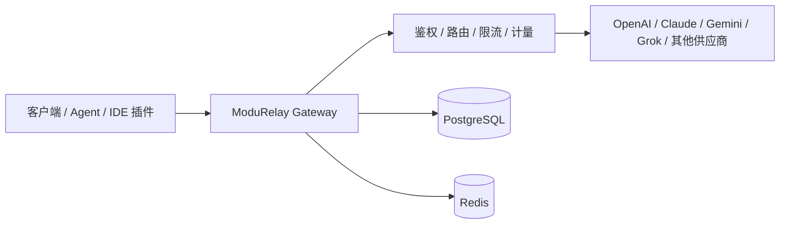

# ModuRelay

**ModuRelay AI Gateway**

一次接入，自由路由所有模型

[English](README.md) | [简体中文](README_CN.md) | [日本語](README_JA.md)

---

[](LICENSE)
[](https://golang.org/)
[](https://vuejs.org/)
[](https://www.postgresql.org/)
[](https://redis.io/)
[](https://www.docker.com/)

## 项目简介

ModuRelay 是开源 AI API 网关，面向多模型供应商统一接入、账号池管理、用量计量与 API 管理。

它可以帮助你：

- 通过统一网关接入多家上游 AI 供应商
- 管理账号池并向用户分发 API Key
- 基于调度与粘性会话进行流量路由
- 统计 Token 用量，并做并发 / 限流控制
- 通过内置管理后台完成日常运营
- 在配置后支持内置支付和用户自助充值
- 使用组合分组将请求模型解析到具体上游供应商
- 将工单等外部系统通过 iframe 嵌入管理后台

ModuRelay 也可作为自研 Agent、IDE 插件及其他 AI 工具的模型接入层，对接 OpenAI 兼容接口或供应商原生协议。

> Langflow、ComfyUI 等工作流集成仍在规划中，详见 [Roadmap](#roadmap)。

## 重要提醒

部署或使用本项目前请仔细阅读：

- 将本软件与上游供应商联用，可能触及对方服务条款；请自行审阅相关协议。
- 仅可在符合所在国家或地区法律法规的前提下使用。
- 你需要自行负责所配置的账号、API Key 与凭据。
- 上游账号稳定性与供应商可用性不作保证。
- 本项目不提供任何 AI 供应商官方授权。
- 部署与运营风险由使用者自行承担。
- 禁止用于违法违规用途。
- ModuRelay 从未授权任何第三方以本项目名义开展商业化运营。

## 项目关系

ModuRelay 是基于 [Sub2API](https://github.com/Wei-Shaw/sub2api) 独立维护的衍生开源项目。

- ModuRelay 不属于 Sub2API 官方项目
- ModuRelay 未获得上游维护者官方背书
- 上游仓库：[Wei-Shaw/sub2api](https://github.com/Wei-Shaw/sub2api)
- 许可证与版权说明见 [LICENSE](LICENSE) 与 [NOTICE.md](NOTICE.md)

## 核心功能

| 功能 | 说明 |
| --- | --- |
| 多账号管理 | 管理多家上游账号 |
| 多种凭据类型 | 在供应商支持的前提下使用 OAuth、API Key 等凭据 |
| API Key 管理 | 为终端用户签发、轮换和控制访问 |
| 智能账号调度 | 按负载与策略选择账号，并支持粘性会话 |
| 用量统计 | 记录 Token 与请求统计 |
| 精确计费 | 支持 Token 级用量追踪、倍率、余额等计费设置 |
| 并发控制 | 按用户 / 分组 / 账号限制并发（取决于场景支持） |
| RPM / 限流 | 应用 RPM 等相关限流策略 |
| 管理后台 | 基于 Vue 的运营控制台 |
| 支付系统 | 在配置后支持 EasyPay、支付宝、微信支付、Stripe 等内置支付方式 |
| 组合分组 | 为多供应商分组将请求模型解析到具体供应商（见 [操作指南](docs/COMPOSITE_GROUPS.md)） |
| 外部系统集成 | 通过 iframe 将工单等外部系统嵌入管理后台 |
| Docker 部署 | 可通过 Docker Compose 从源码构建运行 |

## 架构



## 技术栈

| 层级 | 技术 |
| --- | --- |
| 后端 | Go `1.26.5`（`backend/go.mod`） |
| 前端 | Vue `^3.4`、Vite、TypeScript、pnpm（`frontend/package.json`） |
| 数据库 | PostgreSQL（Compose 使用 `postgres:18-alpine`） |
| 缓存 | Redis（Compose 使用 `redis:8-alpine`） |
| 部署 | Docker / Docker Compose、Linux systemd、源码构建 |

## 快速开始

目前尚未发布正式的 ModuRelay Docker Hub / GHCR 镜像，请从源码构建。

### 环境要求

- Docker 与 Docker Compose v2+
- 或本地 Go + Node.js 开发环境（见 [本地开发](#本地开发)）

### 使用 Docker Compose 构建并启动

```bash
git clone https://github.com/lien0219/modurelay.git
cd modurelay/deploy
cp .env.example .env
# 编辑 .env，至少设置 POSTGRES_PASSWORD（建议同时设置 ADMIN_PASSWORD / JWT_SECRET）
docker compose -f docker-compose.dev.yml up --build -d
```

访问地址由 `SERVER_PORT` 决定（默认 `8080`）。

> 当前 Compose 服务名、数据卷和默认数据库标识仍保留兼容用途的旧名称。ModuRelay 目标命名见 [BRANDING.md](BRANDING.md)。请勿拉取尚未发布的 ModuRelay 镜像。

更多部署说明：[deploy/README.md](deploy/README.md)

## 本地开发

也可参考 [DEV_GUIDE.md](DEV_GUIDE.md)。

### 后端

需要：Go `1.26.5+`、PostgreSQL、Redis。

```bash
cd backend
go run ./cmd/server/
```

常用命令：

```bash
# 编译到 backend/bin/server
make -C backend build

# 单元测试
make -C backend test-unit

# Schema 变更后生成 Ent 代码
cd backend && go generate ./ent
```

### 前端

需要：Node.js 与 pnpm（`packageManager` 指定 `pnpm@10.33.2`）。

```bash
cd frontend
pnpm install
pnpm dev
pnpm typecheck
pnpm build
pnpm test:run
```

根目录便捷命令：

```bash
make build
make test-frontend
make test-backend
```

> `-tags embed` 会将前端构建产物嵌入后端二进制。未使用该标记时，二进制不会直接提供前端 UI。

源码部署前建议重点检查 `config.yaml` 中的这些配置区域：

```yaml
server:
  host: "0.0.0.0"
  port: 8080
  mode: "release"

database:
  host: "localhost"
  port: 5432
  user: "postgres"
  password: "your_password"
  dbname: "sub2api"

redis:
  host: "localhost"
  port: 6379
  username: ""
  password: ""

jwt:
  secret: "change-this-to-a-secure-random-string"
  expire_hour: 24

default:
  user_concurrency: 5
  user_balance: 0
  api_key_prefix: "sk-"
  rate_multiplier: 1.0
```

安全相关配置包括 CORS 允许列表、上游 URL 允许列表、响应头过滤、CSP、计费熔断、可信代理、自定义转发客户端 IP 头以及 Turnstile 要求。自定义客户端 IP 头也可以通过环境变量设置：

```bash
SECURITY_FORWARDED_CLIENT_IP_HEADERS=True-Client-IP,X-CDN-Client-IP
```

生产环境中，除非网络边界明确可控，否则不要允许不安全的 HTTP 上游 URL：

```bash
SECURITY_URL_ALLOWLIST_ENABLED=false
SECURITY_URL_ALLOWLIST_ALLOW_INSECURE_HTTP=false
```

### Nginx 反向代理注意事项

如果通过 Nginx 反向代理 ModuRelay，并配合 Codex CLI 等客户端使用，请在 Nginx 的 `http` 块中加入以下配置，避免带下划线的请求头被丢弃：

```nginx
underscores_in_headers on;
```

## 分支与贡献

| 分支 | 职责 |
| --- | --- |
| `develop` | 日常集成 |
| `main` | 稳定发布 |
| `upstream-main` | 仅镜像上游 `main`，不做二开 |
| `feature/*` / `fix/*` | 功能 / 修复分支，合并回 `develop` |

流程概要：

1. 从 `develop` 创建分支
2. 向 `develop` 提交 PR
3. 验收通过后合入 `main` 发布

相关文档：

- [docs/BRANCHING.md](docs/BRANCHING.md)
- [UPSTREAM.md](UPSTREAM.md)
- [CUSTOM_CHANGELOG.md](CUSTOM_CHANGELOG.md)
- [BRANDING.md](BRANDING.md)
- [NOTICE.md](NOTICE.md)

## 配置说明

可复制 `deploy/.env.example`，或参考 `deploy/config.example.yaml`。请勿提交真实密钥。

| 变量 | 说明 |
| --- | --- |
| `SERVER_PORT` | HTTP 端口（默认 `8080`） |
| `SERVER_MODE` | 服务模式，如 `debug` |
| `RUN_MODE` | `standard` 或 `simple` |
| `DATABASE_HOST` / `DATABASE_PORT` / `DATABASE_USER` / `DATABASE_PASSWORD` / `DATABASE_DBNAME` | PostgreSQL 连接 |
| `REDIS_HOST` / `REDIS_PORT` / `REDIS_PASSWORD` / `REDIS_DB` | Redis 连接 |
| `ADMIN_EMAIL` / `ADMIN_PASSWORD` | 自动初始化场景下的管理员账号 |
| `JWT_SECRET` | JWT 签名密钥 |
| `TOTP_ENCRYPTION_KEY` | 可选 TOTP 加密密钥 |
| `TZ` | 时区 |

当前代码尚未实现 `MODURELAY_` 环境变量前缀。兼容性标识说明见 [BRANDING.md](BRANDING.md)。

## 部署说明

当前真实支持的方式：

| 方式 | 说明 |
| --- | --- |
| Docker Compose（源码构建） | 在正式镜像发布前，优先使用 `deploy/docker-compose.dev.yml` |
| Docker 镜像构建 | 根目录 `Dockerfile` 构建完整应用 |
| Linux / systemd | 单元文件位于 `deploy/`；重命名为 ModuRelay 仍待完成 |
| 源码运行 | `go run` / `make -C backend build`，并构建前端 |

> 正式的二进制、包名与镜像重命名进度见 [BRANDING.md](BRANDING.md)。在迁移完成前，请以仓库中真实存在的脚本为准，不要使用尚未落地的安装路径。

## Roadmap

计划中的方向（尚未宣称已完成）：

- 完善 ModuRelay 品牌资产与部署标识迁移
- 多租户能力
- Langflow 集成指引
- ComfyUI 相关工作流接入模式
- 更丰富的模型路由策略
- 成本分析视图
- 企业私有化部署封装
- Provider / 插件扩展点

## 安全与合规提醒

以上为 ModuRelay 项目提示，不复述任何上游商业授权声明。部署前请阅读 [重要提醒](#重要提醒)。

## 赞助商

本仓库不转载上游项目的赞助商广告、邀请码或推广链接。这些内容属于 Sub2API，不代表 ModuRelay 的赞助关系。

上游赞助信息请查看 [Sub2API 仓库](https://github.com/Wei-Shaw/sub2api)。

## 联系方式

- GitHub Issues：[lien0219/modurelay/issues](https://github.com/lien0219/modurelay/issues)
- 仓库：[lien0219/modurelay](https://github.com/lien0219/modurelay)

目前未公布独立官网、邮箱支持、Discord 或即时通讯群组。

## 许可证与归属

- ModuRelay 遵循仓库 [LICENSE](LICENSE)（GNU LGPL v3）
- 保留上游版权与许可证声明
- ModuRelay 相关修改见 [NOTICE.md](NOTICE.md) 与 [CUSTOM_CHANGELOG.md](CUSTOM_CHANGELOG.md)
- 不得删除 `LICENSE` 或上游版权声明
- ModuRelay 与 Sub2API 上游维护者不存在官方隶属关系
