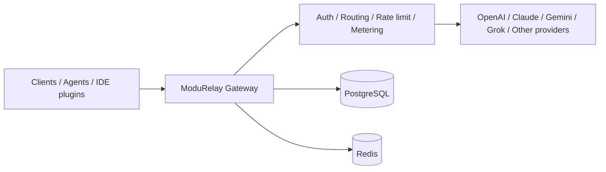

# ModuRelay

**ModuRelay AI Gateway**

Connect once. Route any model.

[English](README.md) | [简体中文](README_CN.md) | [日本語](README_JA.md)

---

[](LICENSE)
[](https://golang.org/)
[](https://vuejs.org/)
[](https://www.postgresql.org/)
[](https://redis.io/)
[](https://www.docker.com/)

> **Translation note:** 本文は英語版 README と同じ構成です。一部の表現は *translation pending* として、英語版を正とします。

## Overview

ModuRelay は、複数プロバイダ対応のルーティング、アカウントプール、利用量計測、API 管理を行うオープンソースの AI API ゲートウェイです。

できること：

- 複数の上流 AI プロバイダを一つのゲートウェイに集約
- アカウントプール管理と API Key 配布
- スケジューリングと sticky session によるルーティング
- Token 利用量の計測と同時実行 / レート制限
- 管理コンソールによる運用

ModuRelay は、OpenAI 互換 API やプロバイダ固有 API を使う自作 Agent、IDE プラグイン、その他 AI ツールのモデル接続層としても利用できます。

> Langflow や ComfyUI 向け連携は計画段階です。[Roadmap](#roadmap) を参照してください。

## Project relationship

ModuRelay は [ModuRelay](https://github.com/Wei-Shaw/modurelay) を基にした、独立して保守される派生オープンソースプロジェクトです。

- ModuRelay 公式プロジェクトではありません
- 上流メンテナによる公式 endorsement はありません
- 上流リポジトリ: [Wei-Shaw/modurelay](https://github.com/Wei-Shaw/modurelay)
- ライセンスと著作権: [LICENSE](LICENSE) および [NOTICE.md](NOTICE.md)

## Core features

| Feature | Description |
| --- | --- |
| Multi-account management | 対応プロバイダの上流アカウントを管理 |
| Credential types | プロバイダが対応する場合、OAuth / API Key などを利用 |
| API Key management | エンドユーザー向け Key の発行・更新・制御 |
| Smart scheduling | 負荷を考慮したアカウント選択 |
| Sticky sessions | 設定時、関連リクエストを優先アカウントへ寄せる |
| Usage metering | Token とリクエスト統計を記録 |
| Billing controls | 倍率・残高などの課金設定 |
| Concurrency control | ユーザー / グループ単位の同時実行制限 |
| RPM / rate limits | RPM などのレート制限 |
| Admin console | Vue ベースの管理 UI |
| Payments | 任意の決済連携（`docs/PAYMENT.md`） |
| Docker deployment | Docker Compose でソースから構築可能 |

## Architecture



## Tech stack

| Layer | Technology |
| --- | --- |
| Backend | Go `1.26.5` (`backend/go.mod`) |
| Frontend | Vue `^3.4`, Vite, TypeScript, pnpm (`frontend/package.json`) |
| Database | PostgreSQL（Compose: `postgres:18-alpine`） |
| Cache | Redis（Compose: `redis:8-alpine`） |
| Deployment | Docker / Docker Compose、Linux systemd、ソースビルド |

## Quick start

公開済みの ModuRelay Docker Hub / GHCR イメージはまだありません。ソースからビルドしてください。

### Prerequisites

- Docker と Docker Compose v2+
- またはローカルの Go + Node.js 環境（[Local development](#local-development)）

### Docker Compose でビルドして起動

```bash
git clone https://github.com/lien0219/modurelay.git
cd modurelay/deploy
cp .env.example .env
# .env を編集し、少なくとも POSTGRES_PASSWORD を設定（ADMIN_PASSWORD / JWT_SECRET も推奨）
docker compose -f docker-compose.dev.yml up --build -d
```

`SERVER_PORT`（既定 `8080`）でアクセスします。

> 現在の Compose サービス名、ボリューム、既定 DB 識別子は互換性のため旧名称を保持しています。目標命名は [BRANDING.md](BRANDING.md) を参照。未公開の ModuRelay イメージを `docker pull` しないでください。

詳細: [deploy/README.md](deploy/README.md)

## Local development

[DEV_GUIDE.md](DEV_GUIDE.md) も参照してください。

### Backend

必要: Go `1.26.5+`、PostgreSQL、Redis。

```bash
cd backend
go run ./cmd/server/
```

```bash
make -C backend build
make -C backend test-unit
cd backend && go generate ./ent
```

### Frontend

必要: Node.js と pnpm（`packageManager` は `pnpm@10.33.2`）。

```bash
cd frontend
pnpm install
pnpm dev
pnpm typecheck
pnpm build
pnpm test:run
```

> **注意:** `-tags embed` フラグはフロントエンドをバイナリに組み込みます。このフラグがない場合、バイナリはフロントエンド UI を提供しません。

**`config.yaml` の主要設定:**

```yaml
server:
  host: "0.0.0.0"
  port: 8080
  mode: "release"

database:
  host: "localhost"
  port: 5432
  user: "postgres"
  password: "your_password"
  dbname: "modurelay"

redis:
  host: "localhost"
  port: 6379
  password: ""

jwt:
  secret: "change-this-to-a-secure-random-string"
  expire_hour: 24

default:
  user_concurrency: 5
  user_balance: 0
  api_key_prefix: "sk-"
  rate_multiplier: 1.0
```

### Sora ステータス（一時的に利用不可）

> ⚠️ Sora 関連の機能は、上流統合およびメディア配信の技術的問題により一時的に利用できません。
> 現時点では本番環境で Sora に依存しないでください。
> 既存の `gateway.sora_*` 設定キーは予約されていますが、これらの問題が解決されるまで有効にならない場合があります。

`config.yaml` では追加のセキュリティ関連オプションも利用できます:

- `cors.allowed_origins` - CORS 許可リスト
- `security.url_allowlist` - 上流/価格/CRS ホストの許可リスト
- `security.url_allowlist.enabled` - URL バリデーションの無効化（注意して使用）
- `security.url_allowlist.allow_insecure_http` - バリデーション無効時に HTTP URL を許可
- `security.url_allowlist.allow_private_hosts` - プライベート/ローカル IP アドレスを許可
- `security.response_headers.enabled` - 設定可能なレスポンスヘッダーフィルタリングを有効化（無効時はデフォルトの許可リストを使用）
- `security.csp` - Content-Security-Policy ヘッダーの制御
- `billing.circuit_breaker` - 課金エラー時にフェイルクローズ
- `security.trust_forwarded_ip_for_api_key_acl` - 従来の生転送ヘッダーによる上書きを制御（アップグレード互換性のため既定で有効）。無効にすると `server.trusted_proxies` を厳格に使用し、ModuRelay に直接接続するプロキシの正確な CIDR のみを指定
- `security.forwarded_client_ip_headers` - サードパーティ CDN のクライアント IP ヘッダーを最大 16 個指定。従来モードが有効な場合のみ、設定順で組み込みヘッダーより先に評価
- `turnstile.required` - リリースモードでの Turnstile 必須化

カスタムクライアント IP ヘッダーは YAML またはカンマ区切りの環境変数で設定できます:

```bash
SECURITY_FORWARDED_CLIENT_IP_HEADERS=True-Client-IP,X-CDN-Client-IP
```

ヘッダー名は検証、正規化、大小文字を区別しない重複排除が行われます。管理画面のセキュリティ設定から再起動せずに更新でき、新規インストールでは YAML/環境変数の既定値を保存し、既存環境ではデータベース値がない場合に補完します。従来モードを無効にするとカスタムおよび組み込みの生転送ヘッダーはすべて無視され、`server.trusted_proxies` のみを使用します。有効にする場合はオリジンへの接続元を CDN/プロキシに制限し、エッジで信頼する全クライアント IP ヘッダーを上書きしてください。移行規則と信頼境界の詳細は [`deploy/EDGE_SECURITY.md`](deploy/EDGE_SECURITY.md) を参照してください。

**⚠️ セキュリティ警告: HTTP URL 設定**

`security.url_allowlist.enabled=false` の場合、システムは最小限の URL バリデーションのみを行い、**デフォルトで HTTP URL を許可**します（開発フレンドリーモード。Docker Compose デプロイのデフォルトも同じです）。本番環境では、以下のように明示的に HTTPS のみに制限することを推奨します:

```yaml
security:
  url_allowlist:
    enabled: false                # 許可リストチェックを無効化
    allow_insecure_http: false    # HTTPS のみ許可（本番環境推奨）
```

**または環境変数で設定:**

```bash
make build
make test-frontend
make test-backend
```

## Branches and contribution

| Branch | Role |
| --- | --- |
| `develop` | 日常統合 |
| `main` | 安定リリース |
| `upstream-main` | 上流 `main` のミラーのみ（二开禁止） |
| `feature/*` / `fix/*` | `develop` へマージする作業ブランチ |

1. `develop` からブランチ作成
2. PR は `develop` 向け
3. 検証後に `main` へ昇格

ドキュメント:

- [docs/BRANCHING.md](docs/BRANCHING.md)
- [UPSTREAM.md](UPSTREAM.md)
- [CUSTOM_CHANGELOG.md](CUSTOM_CHANGELOG.md)
- [BRANDING.md](BRANDING.md)
- [NOTICE.md](NOTICE.md)

## Configuration

`deploy/.env.example` または `deploy/config.example.yaml` を使用してください。秘密情報をコミットしないでください。

| Variable | Purpose |
| --- | --- |
| `SERVER_PORT` | HTTP ポート（既定 `8080`） |
| `SERVER_MODE` | 例: `debug` |
| `RUN_MODE` | `standard` または `simple` |
| `DATABASE_*` | PostgreSQL 接続 |
| `REDIS_*` | Redis 接続 |
| `ADMIN_EMAIL` / `ADMIN_PASSWORD` | 自動セットアップ時の管理者 |
| `JWT_SECRET` | JWT 署名秘密鍵 |
| `TOTP_ENCRYPTION_KEY` | 任意の TOTP 暗号化鍵 |
| `TZ` | タイムゾーン |

現時点で `MODURELAY_` プレフィックスの環境変数は未実装です。[BRANDING.md](BRANDING.md) を参照。

## Deployment

| Method | Notes |
| --- | --- |
| Docker Compose（ソースビルド） | 公式イメージ公開までは `deploy/docker-compose.dev.yml` を推奨 |
| Docker image build | ルート `Dockerfile` |
| Linux / systemd | `deploy/` 配下の unit。ModuRelay への改名は未完了 |
| Source run | `go run` / `make -C backend build` + フロントエンドビルド |

> *translation pending:* 正式なバイナリ / パッケージ / イメージ改名の進捗は [BRANDING.md](BRANDING.md) を正とします。

## Roadmap

計画（未実装として明示）:

- ModuRelay ブランド資産とデプロイ識別子の移行完了
- マルチテナント
- Langflow 連携ガイド
- ComfyUI 向けワークフロー接続パターン
- より高度なモデルルーティング戦略
- コスト分析
- 企業向けプライベート導入パッケージ
- Provider / プラグイン拡張点

## Security and compliance

- 上流プロバイダの利用規約に抵触する可能性があります。各自で確認してください
- 法令に従って利用してください
- アカウントと API Key の管理責任は利用者にあります
- 上流アカウントの安定性は保証しません
- AI プロバイダからの公式認可は提供しません
- デプロイと運用リスクは利用者が負担します
- 違法用途には使用しないでください

## Sponsors

上流 ModuRelay のスポンサー広告・招待コード・プロモーションはここに転載しません。

上流のスポンサー情報は [ModuRelay リポジトリ](https://github.com/Wei-Shaw/modurelay) を参照してください。

## Contact

- GitHub Issues: [lien0219/modurelay/issues](https://github.com/lien0219/modurelay/issues)
- Repository: [lien0219/modurelay](https://github.com/lien0219/modurelay)

現時点で ModuRelay 専用の公式サイト、メール、Discord、チャットグループは公開していません。

## License and attribution

- [LICENSE](LICENSE)（GNU LGPL v3）に従います
- 上流の著作権とライセンス表示を保持します
- ModuRelay 固有の変更は [NOTICE.md](NOTICE.md) と [CUSTOM_CHANGELOG.md](CUSTOM_CHANGELOG.md) を参照
- `LICENSE` と上流著作権表示を削除しないでください
- ModuRelay は ModuRelay 上流と公式な所属関係を持ちません
