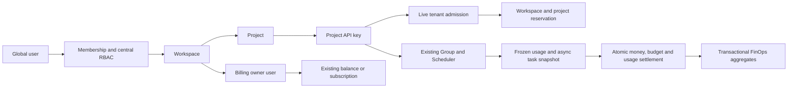

# Enterprise Workspaces, Project Keys and FinOps

## Architecture and decisions

Global `User` remains the login identity and wallet/subscription owner. A user can
join multiple independent workspaces through `workspace_members`. Projects belong
to one workspace. A project key retains its creator in `api_keys.user_id`, binds
immutably to `project_id`, and continues using the existing global Group and
Provider Scheduler. Workspace roles never become the global `admin` role.



| Architecture gate | Decision |
| --- | --- |
| Billing principal | `billing_owner_user_id`, resolved from authoritative workspace storage; personal workspace uses its owner. Developer-created organization keys charge this principal. |
| Legacy keys | Idempotent personal/default-project bootstrap, bounded background batches and conditional lazy assignment. Existing secret, Group, ACL, quota, expiration and enablement are preserved. |
| Historical usage | Tenant columns remain NULL. Never infer historical tenant identity from a key's current binding; unassigned history stays in the original Usage experience. |
| Gateway trust | Authenticate the secret, then resolve key → project → workspace → billing owner on the server. Client body/query/header tenant fields have no authority. |
| Budget versus funding | Existing wallets and user subscriptions fund requests. Workspace/project monthly policies separately constrain billed spend plus pending reservations. |
| Async context | Freeze workspace, project, creator, principal, resolved platform and reservation at admission. Seedance/Grok/AIStarsLab/compatible-video and image recovery settle that snapshot. |
| Immediate state changes | Explicit key/billing invalidation plus live tenant admission on cache hits. Budget admission reads locked PostgreSQL policy/counter rows. Redis invalidation failure cannot authorize a suspended scope. |
| Concurrent hard limits | Workspace/project counters and a durable reservation are changed in one PostgreSQL transaction, in a stable lock order. Never calculate admission with `SUM(usage_logs)`. |
| Owner lifecycle | Workspace mutation locks serialize owner changes. Billing owner must be an active member and user. Replace current ownership obligations before removal/suspension. Pending actor/principal reservations block user deletion until settlement or release, including after owner transfer or workspace archive. |
| Tenant repositories | Membership checks and scoped SQL constrain workspace/project/key resources. Mutation permissions are checked again while holding the workspace lock. |
| Rollups | Transactional UTC-hour aggregates generate daily/monthly trends and dimensions. Exact partial hours use indexed source reads; IANA local-day boundaries include DST and fractional offsets. |
| Feature flag | This release uses one consistent tenant model and exposes workspace navigation directly. It does not maintain a second data model behind an enablement flag. |

`workspace_access.go` owns the permission map. `project_key_service.go` owns the
gateway tenant/principal boundary. `budget.go` and `budget_repo.go` own reservation
admission. Billing repositories persist money, counters, dedup and attributed
usage in one transaction. A billing failure retains uncertain holds for recovery
instead of releasing them and risking a second provider create or payment.

After a safe billing-owner transfer, disabling the previous payer does not
cancel settlement of already admitted work: that work still charges its frozen
principal exactly once. New admission requires active users and resolves the
replacement principal. Deleting a user with pending actor/principal reservations
is blocked by both the lifecycle service and a database trigger. Admission locks
the same user rows, so deletion cannot race with a newly committed hold. Once all
pending work settles or releases, deletion can proceed subject to the remaining
workspace ownership/key obligations. Wallet settlement keeps its existing rule
that deleted users cannot be charged.

## Database and migration

Apply these migrations using the existing checksum-tracked `ApplyMigrations`
runner, before enabling the new application:

| File | Purpose |
| --- | --- |
| `273_workspace_foundation.sql` | Workspaces, memberships, projects, invitations, scoped audit, nullable key project binding, registration bootstrap and user lifecycle guard. |
| `274_project_key_immutable.sql` | Reject key moves; permit legacy NULL binding only to the creator's personal default project. |
| `275_workspace_budgets.sql` | Workspace/project policies, counters, immutable reservations, pending-user deletion guard/indexes, nullable usage attribution and snapshot guard. |
| `276_batch_image_tenant.sql` | Durable image-job tenant/principal/reservation snapshot and identity checks. |
| `277_usage_log_tenant_guard.sql` | Legacy video placeholder attribution requires a matching finalized reservation; no caller-controlled session bypass. |
| `278_tenant_usage_integrity_rollups.sql` | Complete-or-NULL usage shape, composite project/reservation FKs, hour aggregates, UTC daily view and transactional insert/update/delete maintenance. |
| `279_usage_tenant_indexes_notx.sql` | Concurrent indexes for active project keys and workspace/project/principal usage time ranges. |

New tables are `workspaces`, `workspace_members`, `projects`,
`workspace_invitations`, `workspace_audit_logs`, `workspace_budget_policies`,
`project_budget_policies`, `budget_counters`, `budget_reservations`, and
`usage_tenant_hourly_rollups`; `usage_tenant_daily_rollups` is a UTC daily view.
Uniqueness protects personal workspaces, default projects, membership, workspace
and project slugs, invitation hashes/pending emails, and request/key reservations.
Composite FKs protect project/workspace and usage/reservation identity consistency.

The new usage columns are nullable with no historical full-table UPDATE. Usage
FK/check constraints use `NOT VALID`: they enforce subsequent writes without a
deployment-time historical scan. Existing keys/users migrate in bounded
transactions; new user registration bootstraps in the user's insert transaction.
Historical NULL tenant rows are excluded from workspace FinOps. Migrations
273–279 are one initial feature release, so existing historical rows have no
tenant attribution before the new aggregate triggers are installed.

The concurrent index migration can scan large tables but keeps writes available.
Monitor its progress and disk/WAL headroom. Normal DDL still needs brief metadata
locks. Do not edit checksums or previously released migrations to bypass startup
errors. Do not roll an old binary back after organization traffic has started:
it cannot safely interpret the new billing principal. Use a verified database
backup plus a controlled rollback plan if restoration is necessary.

Retention removes corresponding aggregates in the same transaction. Partition
drops explicitly retire their hour range because PostgreSQL does not fire row
DELETE triggers for a DROP. Existing partitioned installations require a separate
DDL compatibility review: PostgreSQL does not support concurrent root-index
creation or NOT VALID foreign keys on every partitioned-table configuration.
If migration 279 is interrupted, the runner drops only its invalid concurrent
indexes before retrying; healthy indexes remain. A failed repair cannot record
the migration as applied.

## RBAC

| Permission | Owner | Admin | Developer | Billing | Viewer |
| --- | --- | --- | --- | --- | --- |
| `workspace.read` | Yes | Yes | Yes | Yes | Yes |
| `workspace.update` | Yes | Yes | No | No | No |
| `workspace.archive` | Yes | No | No | No | No |
| `member.read` | Yes | Yes | Yes | No | No |
| `invitation.read` | Yes | Yes | No | No | No |
| `member.invite` | Yes | Yes, except Owner | No | No | No |
| `member.update` | Yes | Yes, except Owner | No | No | No |
| `member.remove` | Yes | Yes, except Owner | No | No | No |
| `owner.manage` | Yes | No | No | No | No |
| `billing.owner.update` | Yes | No | No | No | No |
| `project.read` | Yes | Yes | Yes | Yes | Yes |
| `project.create` | Yes | Yes | No | No | No |
| `project.update` | Yes | Yes | No | No | No |
| `project.archive` | Yes | Yes | No | No | No |
| `key.read` | Yes | Yes | Yes | No | No |
| `key.create` | Yes | Yes | Yes | No | No |
| `key.update` | Yes | Yes | Yes | No | No |
| `key.revoke` | Yes | Yes | Yes | No | No |
| `usage.read` | Yes | Yes | Yes | Yes | Yes |
| `billing.read` | Yes | No | No | Yes | No |
| `budget.read` | Yes | Yes | Yes | Yes | Yes |
| `budget.update` | Yes | Yes | No | Yes | No |
| `audit.read` | Yes | Yes | No | No | No |

Suspended/archived workspaces and projects expose permitted history reads, while
mutations and gateway admission fail. A suspended member has no permissions.
Personal workspaces cannot invite/remove members or change their billing owner;
default projects cannot be archived. Owner transfer can be performed by granting
another active member Owner and then demoting/removing the previous owner, with
billing obligations transferred first. Global Admin can inspect/suspend tenants,
but workspace roles cannot reach platform provider credentials.

## HTTP APIs and frontend

All panel APIs below use login authentication and existing response/pagination
envelopes. `/workspaces/:w` is a workspace scope; `/workspaces/:w/projects/:p` is a
project scope. Foreign resource IDs return 404, insufficient local permission
returns 403, invalid inputs return 400, and lifecycle/conflict errors return 409.
Gateway budget rejection has a distinct `WORKSPACE_BUDGET_EXCEEDED` or
`PROJECT_BUDGET_EXCEEDED` code and is not an upstream or wallet error.

| Scope | Methods and resources under `/api/v1` |
| --- | --- |
| Workspaces | GET/POST `/workspaces`; GET/PATCH/DELETE `/workspaces/:w` |
| Members | GET `/workspaces/:w/members`; PATCH/DELETE `/workspaces/:w/members/:user_id` |
| Invitations | GET/POST `/workspaces/:w/invitations`; DELETE invitation by ID; POST `/workspace-invitations/accept` with the token |
| Projects | GET/POST `/workspaces/:w/projects`; GET/PATCH/DELETE `/workspaces/:w/projects/:p` |
| Project keys | GET/POST project `/keys`; GET/PATCH/DELETE `/keys/:k`; GET project `/groups/available` |
| FinOps | GET workspace/project `/usage`, `/overview`, `/budget`; PUT workspace/project `/budget` |
| Audit | GET `/workspaces/:w/audit` |
| Platform admin | GET `/admin/workspaces` and `/admin/workspaces/:w`; PATCH `/admin/workspaces/:w/status` |

Budget JSON uses `policy.amount`, `hard_limit`, `enabled` and `timezone`.
The default usage window is the current calendar month in the requested timezone;
explicit ranges are exclusive of `end` and bounded to 366 days. Monetary budget
period labels are frozen at admission; the UI receives their actual local-month
UTC boundaries. No configured/enabled budget means no budget restriction.
Soft policies display overspend and permit calls; hard policies reserve both
scopes atomically. When actual cost exceeds the estimate, finalization checks
both hard scopes for the additional capacity in the billing transaction. If
either lacks capacity, wallet, usage, dedup and budget writes roll back together;
the reservation remains pending for recovery after capacity is available. Soft
policies allow the larger actual cost. Reducing a policy after admission does not
cancel an existing reservation's originally admitted amount, and new admission
observes committed spend plus outstanding holds.

The Vue store owns workspace/project selections, effective server permissions,
stale-response cancellation and persisted selection. Routes provide overview and
settings, projects, project details/keys/budget/usage, members, invitations,
FinOps and audit, plus global Admin workspace controls. Existing Dashboard, Keys,
Usage, Subscriptions and Recharge remain available. New UI follows Frosted
Precision semantic tokens and includes Chinese/English messages. Provider
accounts, official Home and Infinite Canvas business routing stay global.

## Security and tenant review

Threat actors considered: unauthenticated callers, foreign-workspace users,
underprivileged members, former members, holders of revoked/cached keys, spoofed
tenant metadata, replayed invitation tokens, and concurrent lifecycle/billing
requests. Trusted boundaries are authenticated login identity, server-resolved
key identity, scoped repositories and PostgreSQL transaction/constraint checks.
Browser selection/storage and client metadata are never tenant credentials.

Reviewed controls include HTTP IDOR, scoped key reads and mutation locks, central
RBAC, global/admin separation, project restrictions intersecting Group access,
hashed single-use invitations, owner races, active billing-owner obligations,
cache-hit live admission, request/turn snapshots, pending-user deletion guards,
SQL billing dedup, reservation
transitions, and async recovery. Key reads are masked; creation returns the
secret once. Audit metadata contains no API secrets or raw invitation tokens.
No workspace/project names were introduced as metric labels.

Final security gate answers: developer keys charge the workspace billing owner;
legacy secrets are preserved; historical usage is not bulk-rewritten; client
tenant spoofing cannot redirect charge/usage; a funded wallet cannot bypass hard
budget; async settlement retains its creation project and principal; repeat
polling cannot bill/finalize twice; suspended workspaces and archived projects
deny cached keys; keys cannot move projects; workspace owners have no global
provider access unless independently Global Admin; foreign users cannot read
scoped usage by guessing IDs.

## Manual acceptance runbook

Use a disposable deployment built from the workspace feature commit and an
isolated database/cache. The existing local acceptance app is not upgraded by
this implementation task. Prepare Alice (Owner), Bob (Developer), Carol (Billing),
Dave (Viewer), Erin (Admin), and Frank (unrelated Workspace B). Use authorized
global-provider configuration and funded/subscribed test principals. Keep secrets
in the test client only; do not include them in screenshots, audit or reports.
Record request/task IDs, before/after wallet balances, reservation rows, budget
counters and immutable usage IDs for each financial case.

| Scenario | Steps and expected result |
| --- | --- |
| A — Personal user | Upgrade a legacy user; login and open Workspace selector. Exactly one Personal workspace, Owner membership and Default project exist. Repeated login/bootstrap does not duplicate them. Original Group and calls still work. |
| B — Organization | Alice creates ACME, Production and a project key. Configure allowed Groups/pricing as Global Admin. Call GPT, Claude, Grok and Seedance. Confirm workspace/project/principal snapshots. Unavailable providers are NOT RUN. |
| C — Developer | Invite Bob as Developer and accept with his matching login email. He can read projects/usage and create/manage project keys. Direct budget PUT, invitations and billing-owner PATCH return 403. |
| D — Billing | Invite Carol as Billing. She reads usage/budget and updates budget. Key create/revoke and member invitation return 403 even when sent directly. |
| E — Viewer | Invite Dave as Viewer. Read pages work; direct workspace/project/member/key/budget writes return 403. |
| F — Cross-tenant IDOR | As Frank, request ACME workspace, members, invitations, project, key, usage, budget, overview and audit IDs; try their write routes. Expect 404, no data, secret or side effect. Mix B workspace with A project/key IDs too. |
| G — Project archive | Warm the Production key cache with a successful call. Archive a non-default project. Immediate calls and new key creation fail; history remains readable to permitted members. |
| H — Workspace suspend | Warm multiple projects/keys. Global Admin suspends ACME. All keys immediately fail; permitted panel reads retain history. Reactivate only with valid active owners/principal. |
| I — Project hard budget | Fund the principal with $100; set project hard budget $5. Consume to the limit, then call again. Expect PROJECT_BUDGET_EXCEEDED while funds remain. |
| J — Workspace hard budget | Set workspace $20 and projects A/B $10 each. Exhaust workspace spend/reservations. Both reject regardless of separate project headroom. |
| K — Seedance async | Create a priced video with the project key. Check one upstream create, one reservation and bound account. Poll success 20 times. Wallet, usage and both budget counters settle exactly once; terminal failure releases once. Repeat for Grok/AIStarsLab/compatible video when enabled. |
| L — Legacy key | Compare secure pre/post-upgrade snapshots of secret, Group, ACL, limits, expiration and enablement. All are identical except new project binding. Old endpoints continue working. |
| M — Developer payer | Bob creates an organization key. Record Alice/Bob balances, call once, then compare. Alice (current billing owner) pays; Bob's wallet is unchanged. Usage retains Bob as creator/actor. Repeat with a subscription principal. |
| N — Billing-owner change | Create sync/async work under Alice. Alice changes principal to active Carol. New admission charges Carol; existing pending tasks settle Alice and keep their original project. Historical usage principal IDs remain unchanged. |
| O — Principal lifecycle | While Carol is principal, remove/suspend her membership or disable/delete her global user. Expect conflict and atomic rollback. Transfer current ownership first. With an outstanding reservation, disable the former payer and complete the task: it still charges that frozen payer. Deletion remains a conflict until pending work settles/releases; retry deletion afterward and confirm success when no other ownership/key obligation remains. |
| P — Historical usage | Capture legacy NULL tenant rows before upgrade. Bootstrap keys and view FinOps. Old rows remain NULL and excluded; original Usage remains available and the FinOps page explains unassigned history. |
| Q — Spoofing | Send an A key with B workspace/project headers, query and JSON metadata. Check recorded usage/reservation/principal. All remain A; no B balance/counter changes. |
| R — Funding versus budget | Keep wallet/subscription eligible and exhaust project hard budget. Confirm local policy rejection; recharge does not bypass it. Disable the budget explicitly and confirm other funding/quota rules still apply. |
| S — Independent scopes | Give a project headroom while exhausting the workspace. It rejects. Give workspace headroom while exhausting the project. It rejects. Failed dual reservation leaves neither scope with a partial hold. |
| T — Concurrent budgets | Leave $1 headroom and concurrently submit priced requests estimating $10 total. Verify only eligible reservations admit; rejected requests never start providers. Finalized plus pending counters agree with accepted work; failures release holds. |
| U — Concurrent video | Give budget for one video, send two creates concurrently. At most one provider create is admitted. Repeat polling and recovery concurrently; one wallet charge and one finalized reservation survive. |
| V — Project cache | Warm auth cache, archive project, immediately retry on each app instance. Expect denial before cache TTL. Exercise invalidation outage in automated fixtures; live storage remains the admission authority. |
| W — Workspace cache | Warm several keys, suspend workspace and retry on every instance immediately. Also test principal/budget changes and revoke. New requests observe committed state; admitted async snapshots remain frozen. |
| X — Owner race | Create two active owners with a separate active billing owner. Submit demotion/removal operations concurrently. One active owner always remains; failure is conflict and audit reflects only committed changes. |
| Y — Invitation replay | Accept one token concurrently twice and replay after success. Exactly one succeeds. Also test wrong email, expiry, revocation, duplicate membership and an Admin's attempt to grant Owner. No raw tokens appear in persisted audit/JSON reads. |

Additional UI checks: light/dark themes at desktop/tablet/430px/390px; keyboard
focus; long slugs; mobile table overflow confined to its container; loading/error/
empty states; zh/en; stale foreign routes; fast workspace/project switches; and
disabled write controls matching server permissions. Check current local-month
spend and daily midnight boundaries in UTC, Asia/Shanghai and Asia/Kathmandu.
Use a soft budget below spend to confirm overspend display with admitted calls.
Exercise streaming/Responses WebSocket turns, sync images and durable image jobs.
Also exercise an underestimated request: exhaust the remaining hard-budget
capacity before its completion. Confirm settlement changes neither the wallet
nor usage/counters, and retains its pending reservation. Increase the appropriate
budget through an authorized member, then retry polling/recovery and verify one
charge, one attributed usage row and one finalization.

Useful read-only database checks (substitute IDs from the test client):

```sql
SELECT workspace_id, project_id, user_id, billing_principal_user_id,
       api_key_id, resolved_platform, budget_reservation_id, actual_cost
FROM usage_logs WHERE request_id = :request_id;
SELECT id, workspace_id, project_id, billing_principal_user_id,
       estimate, actual, status FROM budget_reservations WHERE id = :reservation_id;
SELECT scope_type, scope_id, period_start, spent, reserved
FROM budget_counters WHERE scope_id IN (:workspace_id, :project_id);
SELECT bucket_date, SUM(request_count), SUM(actual_cost)
FROM usage_tenant_daily_rollups WHERE workspace_id = :workspace_id GROUP BY 1;
SELECT action, actor_user_id, project_id, target_type, target_id, metadata
FROM workspace_audit_logs WHERE workspace_id = :workspace_id ORDER BY id DESC;
```

## Verification boundaries

Local command evidence and baseline comparisons are retained under ignored
`.cache/workspace-enterprise/`. The baseline is detached `27f04468b`; no branch
switch, push, PR, or acceptance-runtime cutover is part of this work. Automated provider fixtures do not
establish real provider availability, performance under production load, or manual
browser acceptance. Those checks must be recorded separately as PASS/FAIL/NOT RUN.

The final backend source was frozen before the following 2026-10-05 verification.
Frontend/Canvas source has not changed since its recorded passing verification.
Exact commands, exit codes and output are in `final-source-backend-verification.json`,
`resume-final-frontend-verification.json`, `final-source-tenant-video-regression.log`
and `resume-canvas-video.log` in the local evidence directory.

| Verification | Actual result |
| --- | --- |
| `gofmt -l` on all 137 changed Go files | PASS; no unformatted files. |
| Backend `go test -count=1 -timeout=15m ./...` | PASS. |
| Backend `go test -tags=unit -count=1 -timeout=15m ./...` | FAIL / PRE-EXISTING; only `TestOllamaProbeCallback_StaleLongDoesNotOverrideNewShort`. |
| Backend `go test -tags=integration -count=1 -timeout=15m ./...` | PASS, including the final pending-principal lifecycle guard. |
| Clean ordinary PostgreSQL 18.1 + Redis 8.4, all historical/new migrations and repository integration | PASS; `CI=true` prevents a missing-Docker skip. |
| Targeted tenant, budget, batch-image, Seedance/Grok/video service, handler and middleware unit regressions | PASS in all three packages on final source. |
| `go vet ./...` | PASS. |
| `go build ./...` | PASS. |
| Pinned golangci-lint v2.13.2 with project configuration | PASS. |
| Frontend `pnpm run typecheck` | PASS. |
| Frontend `pnpm run lint:check` | PASS. |
| Frontend `pnpm run test:run` | PASS; 401 files, 2,962 tests. |
| Frontend `pnpm run build` | PASS. |
| Canvas Playwright video cancellation/pending-task reload regression | PASS; 1 test. |
| Source security, tenant isolation and final diff review | PASS; scoped SQL, RBAC, invitations, owner/principal lifecycle, cache admission, immutable billing, masking and no secret/debug/skip artifacts reviewed. |
| Real GPT/Claude/Grok/Seedance/other-provider smoke | NOT RUN. |
| Authenticated browser/manual A–Y acceptance and local acceptance-app cutover | NOT RUN. |
| Production-scale load/retention and existing partitioned Usage DDL | NOT RUN. |
| Formal security plugin scan / external penetration test | NOT RUN. |

The Ollama failure was reproduced with the same targeted test on this source and
detached parent `27f04468bd90fdcf4d13a851d87e9d2b88fde652`: both report
`Should be zero, but was 1` / `stale long callback must not pass the CAS` at
`ratelimit_service_ollama_429_test.go:405`. The matching outputs are in
`resume-ollama-current.log` and `resume-ollama-baseline.log`; final full-unit output
is `final-source-backend-unit.log`. The entire parent repository integration
also passed. No Ollama implementation/assertion or security contract was weakened
to change this baseline result.

Operational risks include underestimated costs waiting for additional hard-budget
capacity, ambiguous provider creates retaining their holds, and pending actor/payer
reservations preventing user deletion until recovery finishes. Production-scale
load/retention and existing partitioned Usage DDL compatibility remain unverified.
The security review is a source/tenant review supported by regression tests; no
formal Codex Security plugin scan or external penetration test was executed.


## Phase B enterprise identity

Migration 294 adds verified domains, generic OIDC with Entra/Google/Okta presets,
explicit account linking, atomic JIT, provider-attributed role/Team mapping,
Workspace-bound session assurance, human control-plane SSO enforcement and
Owner recovery. Global User, Personal Workspace, Direct Key, Service Account,
Gateway, policy, project grants and immutable billing retain their boundaries.
See [ENTERPRISE_SSO.md](ENTERPRISE_SSO.md) for configuration/security/API details
and [ENTERPRISE_SSO_ACCEPTANCE.md](ENTERPRISE_SSO_ACCEPTANCE.md) for deferred
manual validation. Real IdPs and final browser acceptance are NOT RUN.

## Phase C enterprise identity advanced

SAML extends the shared identity-provider and SSO enforcement model with bounded
metadata/ACS, mature-library signatures/encryption, replay protection and encrypted
per-provider key rotation. SCIM adds independent connector-scoped provisioning
with show-once/hash-only bearer credentials and opaque resources.

Membership/Team sources coexist across manual,OIDC,SAML and SCIM. Exact source
removal preserves others; administrator suspension/removal wins. Groups require
explicit existing-Team binding and use existing Project Access Grants. Owner and
Billing Owner remain manually managed. No historical Usage/Billing/Key/Service
Account rewrite or new Gateway protocol dependency occurs. Operational details
and local/deferred acceptance are in [ENTERPRISE_SAML.md](ENTERPRISE_SAML.md),
[ENTERPRISE_SCIM.md](ENTERPRISE_SCIM.md) and their acceptance documents.
