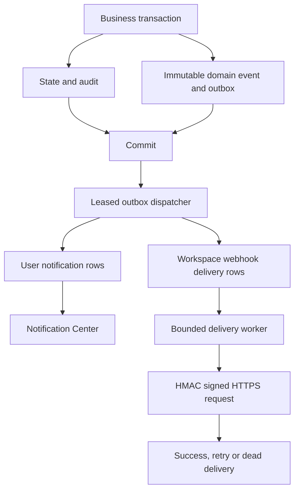

# Reliable events and notifications

ModuRelay records domain events with business state, then dispatches them to a
durable user inbox and workspace webhook queue. Webhook delivery is asynchronous
and **at-least-once**. Financial settlement continues to use the existing billing
receipt, immutable reservation and usage identity for exactly-once money effects.

## Current architecture findings

- Workspace, project and membership changes already use explicit SQL
  transactions with audit records in `workspace_mutation.go`. Domain events are
  written before those transactions commit. Administrative status changes use
  the same approach in `workspace_reads.go`.
- Personal workspace creation also runs during user registration through
  `ensure_personal_workspace`. Migration 282 adds an insert trigger so both
  registration and lazy bootstrap capture the actual creation, including
  concurrent first access. Existing workspaces are not replayed.
- Project API key mutations use an Ent transaction in
  `project_key_repo.go:WithProjectKeyMutation`. Public key metadata, audit and
  outbox writes share that transaction; the returned creation secret does not
  enter events, notifications or webhook history.
- Budget admission and settlement use `budget_counters` and
  `budget_reservations`, not a second aggregation of usage logs. Alert detection
  runs in `settleBudgetReservationTx` on the wallet/usage transaction.
- Seedance and Grok share frozen video settlement commands, durable billing
  receipts and the Redis recovery queue. `ApplyVideoUsage` retains those
  identities and adds a separate durable alert transition for a pending
  financial obligation.
- Existing workers have explicit start/stop ownership in server dependency
  injection. The new dispatcher and webhook worker use cancellation and wait
  for their bounded processing loops during shutdown.
- Existing URL validation, DNS pinning and secret encryption helpers are reused
  by webhook delivery. Webhooks add HTTPS-only and stricter public-IP checks,
  block redirects, bypass environment proxies and pin the connection to the
  validated DNS result on each attempt. See [WEBHOOKS.md](WEBHOOKS.md).
- `notifyBalanceLow` and `notifyAccountQuota` still run after billing through
  the existing asynchronous notification services. These legacy calls are
  best effort and are not represented as durable outbox events by this change.
  Provider account quota alerts stay operator-facing; upstream account details
  are never copied into a tenant inbox.

## Transaction and delivery boundaries

Dispatch claims use PostgreSQL `FOR UPDATE SKIP LOCKED`, an expiring lease and a
fresh opaque claim token. Acknowledgement requires the current token and a live
lease. A crash leaves the row reclaimable after lease expiry. An event is
acknowledged only after notification and delivery rows have been persisted.
Inbox identity is `(event_id, recipient_user_id)`; webhook delivery identity is
`(webhook_id, event_id)`. Partial dispatch followed by replay cannot add duplicate
rows. An event payload is never rebuilt from current workspace or budget state.

The dispatcher claims at most 100 events per batch. Delivery uses a bounded
batch and fixed concurrency; it does not create unbounded per-event goroutines.
SQL due indexes support ordered queue claims. See the 10,000-event integration
test and concurrency tests in the repository.

## Event envelope and supported producers

Every current external event uses schema version 1. The envelope contains a
globally unique `evt_` ID, stable event type, UTC creation timestamp, nullable
workspace/project/actor IDs, a typed subject and explicit scalar data fields.
The database checks envelope identity and scope against its indexed columns;
updates cannot change the event snapshot. Breaking field changes require a new
version.

| Producers | Event types |
| --- | --- |
| Workspace mutations | `workspace.created`, `workspace.updated`, `workspace.suspended`, `workspace.resumed`, `workspace.archived` |
| Membership and invitations | `member.invited`, `member.joined`, `member.role_changed`, `member.suspended`, `member.removed` |
| Project mutations | `project.created`, `project.updated`, `project.archived` |
| Project API key mutations | `api_key.created`, `api_key.updated`, `api_key.revoked` |
| Service Account mutations | `service_account.created`, `service_account.updated`, `service_account.disabled`, `service_account.enabled` |
| Service Account Credential mutations | `service_account.credential.created`, `service_account.credential.updated`, `service_account.credential.revoked`, `service_account.credential.rotated` |
| Budget policy and actual spend | `budget.updated`, `budget.threshold_reached`, `budget.soft_limit_exceeded`, `budget.hard_limit_reached` |
| Accepted video settlement | `billing.settlement_pending`, `billing.settlement_recovered` |
| Explicit endpoint test | `webhook.test` |

There is no permanent failed-settlement state in the existing recovery system,
so no `billing.settlement_failed` producer is added. Quota period/reset state is
not durable enough for new tenant quota events; the existing operator quota
notifications remain in place. There is no project restore operation in the
current API. Reserved event identifiers do not imply an implemented producer.

Service Account state, human management audit and outbox share the mutation
transaction. Payloads contain only public metadata and SA/credential IDs, never
the one-time secret or stored digest. Rotation records old/new credential IDs.
`service_account.credential.expiring` and `.expired` are reserved; automatic
expiration producers are **DEFERRED**. Credential expiration admission still
uses the existing API-key check. See [SERVICE_ACCOUNTS.md](SERVICE_ACCOUNTS.md).

## Budget alert semantics

- Default spending thresholds are 50%, 80% and 100%, for both workspace and
  project policies. Ordinary threshold alerts use finalized billed spend only.
- Reserving or releasing a hold does not send a spending threshold alert.
  A soft policy permits admission and settlement above the limit; the 100%
  crossing emits `budget.soft_limit_exceeded`.
- A hard policy emits `budget.hard_limit_reached` for the finalized 100%
  crossing or an actual admission rejection. `reason_code=finalized_spend`
  identifies billed spending; `reason_code=admission_rejected` identifies
  insufficient admission capacity for that request, including a request whose
  estimate exceeds an otherwise unused limit. `spent` and `reserved` are the
  counter snapshot at the transition. An admission alert does not claim that
  the whole budget has already been billed.
- Failed admission rolls back tentative counters and reservations. A separate
  committed transaction locks the scopes, rechecks the live hard policy, and
  records the deduplicated rejection transition and event. First rejection does
  not create ghost counters. A zero hard limit can reject and notify once.
- Deduplication includes scope type and ID, the policy-local calendar month,
  policy revision and threshold. The 100% hard transition is shared between
  rejection and finalized exhaustion within that identity. Repeated rejected
  requests cannot send another alert for the same transition.
- A policy edit increments its revision. Already crossed finalized thresholds
  are seeded for the new revision without historical notifications; later real
  crossings use that revision. For example, changing a $100 policy at $85 spent
  to $200 seeds no 50%/80% crossing; reaching $160 can emit its new 80% event.
- Migration 280 seeds existing crossed counters without producing events. It
  does not scan usage or replay historical 50%/80% alerts.
- Each scope uses its configured timezone to identify its calendar month.
  Admission records independent workspace/project month labels; delayed
  settlement keeps those labels. A new month has new transition identities.

## Pending billing and recovery

An accepted video whose final cost cannot be committed keeps its reservation
pending and its frozen recovery command intact. The failed money transaction
first rolls back. `billing_settlement_alerts` and the pending event then commit
together on a bounded, independent SQL transaction. A racing successful worker
prevents a stale pending alert by closing the reservation before the pending
transaction can acquire it.

Pending state is deduplicated by reservation and by request/API-key identity.
Its public snapshot contains request/task ID, public model/platform, estimated
and actual amounts, and a bounded reason code. It contains no provider account
ID, credential, proxy, upstream URL or account health information.

Successful recovery updates the alert state and inserts
`billing.settlement_recovered` on the **same transaction** as the wallet,
quota, immutable usage row, reservation finalization and billing receipt. If
the event insert or commit fails, all of those updates roll back. Repeated
polling/recovery finds the existing receipt and cannot charge again. Alert
dedup state survives event retention; it never authorizes a charge. If the
database itself is unavailable, the pending alert write also fails and recovery
must retry; no successful notification is fabricated.

## Central recipient rules

`NotificationRecipientResolver` is the only recipient authority. Ordinary
recipients must have active membership and an active, undeleted user identity.

| Event family | Recipients |
| --- | --- |
| Budget and settlement | Owner, Admin, Billing |
| Workspace lifecycle | Active members; workspace suspension does not disable inbox reads |
| Membership | Owner, Admin, affected active user identity, including the just-removed or suspended member |
| Project | Owner, Admin, Developer |
| API key | Owner, Admin, mutation actor |
| Service Account / Credential | Active Owner, Admin, Developer; includes platform disable/revoke |
| Webhook test | Initiating actor |

Roles are resolved from the current control plane at dispatch. A removed member
does not continue receiving ordinary tenant events. Its own removal/suspension
notice uses the immutable affected-user identity. Inbox ownership is always the
authenticated user, independent of the selected workspace and billing owner.

## Notification API

All endpoints use the existing authenticated user middleware:

| Method | `/api/v1` path | Behavior |
| --- | --- | --- |
| GET | `/notifications` | Paginated inbox; category, unread and optional workspace/project filters |
| GET | `/notifications/unread-count` | Unread count, with optional workspace/project filters |
| POST | `/notifications/:id/read` | Mark only the authenticated user's item read |
| POST | `/notifications/read-all` | Mark the authenticated user's matching scope read |

Scope parameters are query parameters for both GET and POST. List order is
`created_at DESC, id DESC`. Page size is bounded to 100. Unknown or another
user's notification ID has the same not-found response; supplying scope IDs
cannot grant access to another user's inbox.

## Existing notification compatibility and frontend

The header keeps **two bells**: the independent `AnnouncementBell` for platform
broadcasts and `NotificationCenterBell` for personal/tenant events plus existing
Resource Center activity. Resource Center retains its API, unread state and
request/collaboration/chat destinations through a frontend adapter. No resource
history is migrated to domain events.

The Notification Center defaults to all of the user's notifications, with
explicit workspace/project scope and category/source filters. It supports
unread counts, mark-one/mark-all, pagination, translated event captions,
navigation and stale-response cancellation on context changes. Announcement,
custom homepage, portal and Canvas behavior remain independent.

Existing balance emails and operator account quota alerts remain enabled.
Replacing them later requires their own reliable state-transition and delivery
contract; this release does not convert best-effort provider notifications into
tenant events.

## Storage, retention and operations

Migrations 280–283 add immutable `domain_events`, `domain_event_outbox`,
`user_notifications`, `budget_alert_transitions`, `workspace_webhooks`,
`workspace_webhook_subscriptions`, `workspace_webhook_deliveries`, webhook test
rate-limit state, and `billing_settlement_alerts`. Existing migrations 273–279
are unchanged. Scope foreign keys, state checks, unique dedup identities and
partial queue/unread/retention indexes enforce the contracts in PostgreSQL.

Dispatcher cleanup runs in bounded batches: user notifications 180 days,
succeeded delivery history 90 days, dead delivery history 180 days and
published outbox history 90 days. Pending/retrying rows and active leases are
preserved. Event removal waits until dependent history and outbox work have
expired; unfinished billing alert state remains independent and durable.

Worker logs include event/delivery/webhook/workspace IDs, attempt and bounded
failure codes. Secrets, payloads and URLs are excluded. Consumers should monitor
queue age, retry/dead states and worker failure logs. No endpoint URL or tenant
name is used as a metric label.

Use [the acceptance runbook](DOMAIN_EVENTS_ACCEPTANCE.md) for manual and
production-like verification. Passing local tests does not establish real
customer receiver or real-provider acceptance.
