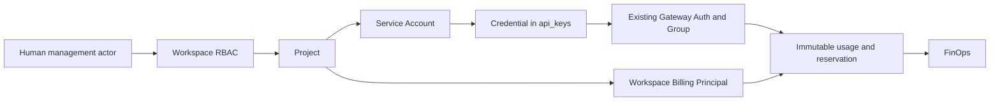

# Service Accounts / Machine Identity

Service Account 是 Project 的机器执行主体，适合生产后端、CI 和数据任务。
它不属于创建它的员工，也不是隐藏的 User。Bob 创建 `backend-api`，Alice 是
Workspace 付款方时：调用属于 `backend-api`，费用属于 Alice。Bob 离职后失去管理
权限，但仍 active 的机器身份和凭据继续工作。



## Architecture findings and gate decisions

原 `api_keys.user_id` 是人类 Key 的用户归属/执行主体，旧列表、权限、缓存和并发
限流依赖它；租户费用另由 `Workspace.billing_owner_user_id` 决定。
`usage_logs.user_id` 保留人类请求归属，租户 Usage 另有 Workspace、Project、付款方
和 Reservation 快照。原 `BudgetAttribution.ActorUserID` 只允许正的人类 User ID。
机器请求不能把这些 Actor 字段填成 creator 或 payer。

| Gate | 实现决策 |
| --- | --- |
| Q1 API Key 结合 | `service_accounts` 关联 `api_keys.service_account_id`，不建立平行 Credential 表。 |
| Q2 Secret/Auth 复用 | 复用现有安全随机生成器、前缀、认证入口、限制和缓存；新机器 Key 只持久化 `sha256:` 查找摘要，旧人类 Key 合同不变。 |
| Q3 原 Key User | 人类归属/执行 User，不能填机器创建者。 |
| Q4 机器 User | SQL NULL / Go zero；DB 约束保证 User 和 SA 恰有一个执行主体。 |
| Q5 Gateway principal | `ExecutionPrincipal{Type:user, UserID}` 或 `{Type:service_account, ServiceAccountID}`，经原 API Key Middleware 注入。 |
| Q6 Budget actor | 新增 SA ID，机器 Go Actor=0 / SQL actor=NULL；付款方独立保存。 |
| Q7 Usage User | 人类历史语义不变；机器 User=NULL，显式保存 SA ID。 |
| Q8 Usage snapshot | 写入时冻结 SA、Workspace、Project、Key、付款方、平台、Reservation，触发器阻止重写身份。 |
| Q9 Async | 视频 pending/recovery、异步图片、Batch Image、Live 保存机器快照，结算不根据当前 Key 推断旧身份。 |
| Q10 Creator lifecycle | 认证不依赖 creator Membership/余额；creator FK `ON DELETE SET NULL`，现有用户软删除也不改变机器归属。 |
| Q11 Disable/cache | 提交后主动 invalidate 关联 Key 缓存；现有逐次 joined SQL 准入再查真实状态，缓存失效失败不能长期授权旧状态。 |
| Q12 Human compatibility | 旧 Key 不迁成 SA、不回填；人类并发、RPM、HTTP Responses 续接、Fast 用户策略保留原执行 User 语义。 |
| Q13 旧 Key mutation | User/Project Key 管理排除机器，旧全局 Group 修改也拒绝机器；专用路径执行 RBAC 和租户事务。共享 DTO 屏蔽机器摘要。 |
| Q14 Cache snapshot | 含 SA ID/status、Project、Workspace、付款方及原 Key/Group 限制；版本升级，真实准入独立校验。 |
| Q15 Global Admin | 搜索、安全元数据、disable SA、revoke Credential、平台审计及租户事件；无 Secret 读取或 impersonation。 |

HTTP Responses/视频采用分离的人类和机器缓存 ownership namespace。负 SA ID 仅用于
内部缓存，不写入 SQL User/Actor。Responses 允许同 SA 轮换后的 Key 续接，其他 SA/
User 不能通过相同 Key ID 借用归属。用户 Fast 策略读取 ExecutionPrincipal，机器不
匹配 payer 的用户规则；利润/费用规则使用付款方。

## API

控制面使用现有 Panel 人类认证，Credential 本身不能管理凭据。共同前缀：

```text
/api/v1/workspaces/:id/projects/:project_id/service-accounts
```

| Method | 前缀后的路径 | 行为 |
| --- | --- | --- |
| GET / POST | 空 | 分页列表 / 创建 SA |
| GET / PATCH | `/:service_account_id` | 查看 / 更新名称和描述 |
| POST | `/:service_account_id/disable` | 禁用新调用 |
| POST | `/:service_account_id/enable` | 恢复仍有效的凭据 |
| GET / POST | `/:service_account_id/credentials` | 安全元数据 / 创建凭据 |
| PATCH | `/:service_account_id/credentials/:credential_id` | 更新元数据及已有限制 |
| POST | `/:service_account_id/credentials/:credential_id/rotate` | 创建替代凭据 |
| POST | `/:service_account_id/credentials/:credential_id/revoke` | 永久撤销 |

SA 创建接受 `name`、`slug`、`description`，Slug 使用原小写数字连字符验证。同 Project
唯一，不同 Project 可同名。SA/Credential Project 不可移动；第一版保留记录，通过
disable/revoke 管理生命周期，不提供物理删除。

Credential 创建复用 `CreateAPIKeyRequest` 的 `name`、`group_id`、IP 白/黑名单、quota、
`expires_in_days` 和 `rate_limit_5h/1d/7d`，禁止 custom Secret。
PATCH `expires_at:null` 清除到期时间，`reset_quota:true` 清零额度用量。提高/重置 quota
可恢复 `quota_exhausted`；清除/延长有效期可恢复 `expired`，仍检查 active 数量上限。
revoked 永远不能恢复。列表只返回 ID、名称、后四位、状态、Group、限制、时间等安全
元数据。last_used 复用原异步更新机制，不新增逐请求同步 UPDATE 热点。

平台 API：`GET /api/v1/admin/service-accounts?search=...`、
`GET /api/v1/admin/service-accounts/:service_account_id`、
`POST /api/v1/admin/service-accounts/:service_account_id/disable`、
`POST /api/v1/admin/service-accounts/:service_account_id/credentials/:credential_id/revoke`。
平台 Admin 和 Workspace Admin 分开授权。

采用原错误合同：无权限 403，隐藏/跨作用域目标 404，无效凭据 401，生命周期、
唯一性或数量冲突 409，输入错误走既有请求验证响应。数量错误为
`SERVICE_ACCOUNT_LIMIT`，Secret 重放为 `SERVICE_ACCOUNT_SECRET_CONSUMED`。

## RBAC and lifecycle

| 能力 | Owner | Admin | Developer | Billing | Viewer |
| --- | --- | --- | --- | --- | --- |
| SA read | 是 | 是 | 是 | 是 | 是 |
| SA create/update/disable/enable | 是 | 是 | 是 | 否 | 否 |
| Credential metadata read | 是 | 是 | 是 | 否 | 否 |
| Credential create/update/rotate/revoke | 是 | 是 | 是 | 否 | 否 |
| Usage / FinOps (`usage.read`) | 是 | 是 | 是 | 是 | 是 |

使用唯一 `workspaceRolePermissions`，SQL 再约束 Membership、Workspace、Project、
SA 和 Key。同 Workspace 的错误 Project path 也拒绝。Workspace suspended、Project
archived 按原 RBAC 允许历史读取，普通 mutation 和 Gateway 新请求拒绝。
Global Admin 风控是独立授权路径。机器没有 Email、Password、TOTP、Panel Session、
Workspace Membership 或 Role。

准入要求 Credential、SA、Project、Workspace、付款方及其 Membership 有效，并满足
原 Group/模型/ACL/额度/到期规则。客户端 body/query/header 中的租户/SA ID 不参与
身份选择。有效权限只能收紧原 Group 权限。

默认每 Project 100 个 SA、每 SA 10 个 active Credential。设置项
`service_accounts_max_per_project`、`service_accounts_max_active_credentials` 可覆盖。
active/quota_exhausted 且未到期的 Key 计入上限。Workspace/SA 锁串行化创建、轮换和
恢复，DB Unique 是 Slug 最终防线。设置在事务前读取；Group/付款方检查使用现有
事务连接，支持单连接池，不向被自己占用的连接池再次查询。

## Secret and zero-downtime rotation

Create/Rotate 返回 `{credential, secret}`，Rotate 另有 `previous_credential_id`。
Secret 只显示于当前弹窗；关闭、路由切换或卸载即清除，不写 localStorage、持久化
store、URL、Audit、Event、Notification 或 Webhook。查找摘要不能作为 Bearer Key，
也不从列表、详情或管理员 Usage 关联对象返回。

复用原 `Idempotency-Key` 协调器，durable response 仅保存安全 Credential 元数据。
重试返回 409 `SERVICE_ACCOUNT_SECRET_CONSUMED`，附原 `credential_id`，不重放
Secret。响应丢失应撤销该凭据并重新创建。携 Idempotency-Key 但存储不可用时返回
不可用错误，不能假装幂等成功。

轮换 A → B：创建独立 B，继承原限制/有效期，新 Key 用量计数归零；A 的 Secret、
状态、限制、计数不改变。先迁移应用并确认 B，再显式 revoke A。没有自动延迟撤销。
禁用/到期的旧凭据不会因轮换被重新启用。

凭据放环境变量或 Secret Manager，不放浏览器业务代码、不 commit Git。定期 rotate，
怀疑泄漏立即 revoke，不以员工个人 Key 作为长期生产机器身份。

## Billing, budget and platform quota

creator、execution principal、billing principal 是三种身份。机器没有自己的余额或
订阅，使用当前 Workspace Billing Principal。Balance 模式使用付款方原 User ×
Platform quota，Subscription 保留原豁免；不使用 creator quota。机器并发和 User/
Group RPM 使用付款方；人类 Key 保留原人类命名空间和 RPM override。
没有新增 SA 独立 Budget/RPM 或 Policy Engine。

机器受 Workspace/Project Budget、Key quota 和 Group 限制。Reserve 保存机器 Actor、
Key、租户和付款方；Finalize/Release 复用原事务、精度及幂等规则。
已接受 async task 使用冻结的 SA、付款方、Key、Group、Subscription 和 Reservation。
之后 disable/revoke、creator 离职、付款方变更只影响新准入；后台继续旧快照结算，
重复 poll/recovery 不重复扣钱包、quota 或 budget。
Batch Image 原 `user_id` 是 payer，保持该合同，另存机器快照。

Live 保留原零费用 telemetry。机器 Live 在 Provider 调用前 admit/finalize 一个
0 金额 Reservation，Redis 映射保存 receipt 和所有身份维度；Sideband/observer
重载后仍用原 payer 并发 namespace。Usage 关联相同 receipt，不增加钱包、quota 或
时长收费。人类 Live 保留原归属行为。

## Usage and FinOps

同步、streaming、图片、视频、recovery 保存机器快照，机器 Usage/Audit evidence 不
把 creator/payer 当人类 caller。内容审核、Prompt Audit、Ops 保存 SA ID 并清空机器
User/Email 快照；管理审计 actor 仍为操作人类。Generic User/Admin Usage DTO 也返回
nullable `service_account_id`，不从当前 Key 推断历史。

Workspace/Project overview 和 usage API 支持 `service_account_id` filter 并检查所属
租户/Project。后端 hourly rollup 加边缘时间窗原始 Usage 聚合 Requests、Spend、
Tokens、Platforms、Models；Project UI 展示机器 breakdown，旧数据显示 Human / Legacy。
显示名称可随 rename 更新，ID/金额始终来自历史快照。前端不拉全量 Usage 自行聚合。

## Database and migrations

| 文件 | 作用 |
| --- | --- |
| `284_service_accounts.sql` | SA 表；Key/Usage/Budget/Batch nullable SA ID；互斥主体、复合租户 FK、摘要、不可变身份及 Reservation 匹配约束。 |
| `285_service_account_usage_rollups.sql` | `usage_service_account_hourly_rollups` 及 insert/update/delete reconciliation，保留原 tenant rollup。 |
| `286_service_account_indexes_notx.sql` | Key、Usage(created_at)、pending Reservation、Batch 四个机器 partial index。 |
| `287_service_account_domain_events.sql` | SQL Event allowlist 的机器字段，不允许 Secret/digest。 |
| `288_service_account_audit_attribution.sql` | 内容审核、Prompt Audit Job/Event、Ops Error/System 的 SA 字段、FK、机器 Actor/Email 约束。 |
| `289_service_account_audit_indexes_notx.sql` | 五个审核/Ops 机器 created_at partial index。 |

`UNIQUE(project_id,slug)`，复合 FK 保证 SA/Project 在同 Workspace。Key 的机器及
Project 绑定不可改变。Usage/Budget/Batch 触发器逐维比较冻结身份，避免 NULL 让
MATCH SIMPLE FK 跳过机器校验。creator 物理删除只清空 provenance；有历史义务的
SA 保留，不物理删除。

不 backfill Usage，不自动转换旧 Key，不执行大表 UPDATE。新字段 nullable；热表
约束 `NOT VALID` 仍校验新写入，本轮不扫描历史验证。ALTER 需要短暂表锁，发布时
观察锁等待。286/289 使用现有 NOTX runner 的 `CREATE INDEX CONCURRENTLY`；中断
留下 INVALID index 时并发删除并重建，隔离 PostgreSQL 故障注入已覆盖。
沿用 `schema_migrations` checksum，不修改历史 migration 文件。

## Events and operations

八个真实 mutation producer：

```text
service_account.created
service_account.updated
service_account.disabled
service_account.enabled
service_account.credential.created
service_account.credential.updated
service_account.credential.revoked
service_account.credential.rotated
```

业务、human management audit、Event 和 outbox 同事务，提交后 invalidate cache。
Global Admin disable/revoke 也生成平台审计及租户事件。数据只含公开名称、SA/
Project/Credential ID、有效期和 old/new Credential ID，不含 Secret、digest 或
Authorization。当前整个 SA family 通知 active Owner/Admin/Developer；退出的
creator 不再收到普通通知。复用统一 Notification Center。
Webhook 使用具体事件名，保留 immutable envelope、HMAC、SSRF、retry、lease 及
at-least-once 合同。见 [NOTIFICATIONS.md](NOTIFICATIONS.md)、[WEBHOOKS.md](WEBHOOKS.md)。

`service_account.credential.expiring`、`service_account.credential.expired` 名称预留，
自动 Producer **DEFERRED**。到期认证已实现；没有 7 天/1 天扫描或自动过期通知任务。
本次不实现 STS、SSO/SCIM、独立机器 Budget、自动轮换 Agent 或新策略引擎。

后续真实验收见 [SERVICE_ACCOUNTS_ACCEPTANCE.md](SERVICE_ACCOUNTS_ACCEPTANCE.md)。
本轮真实上游及最终总体验收 **NOT RUN**，不能据自动测试宣称上线验收完成。
